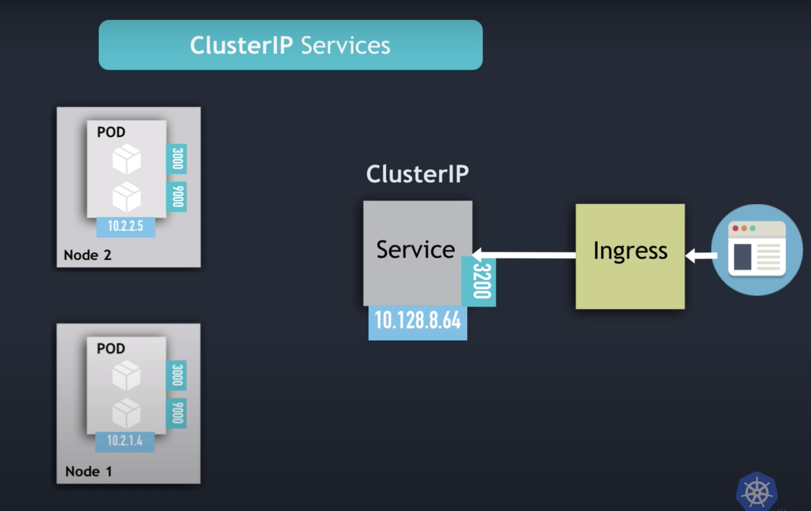
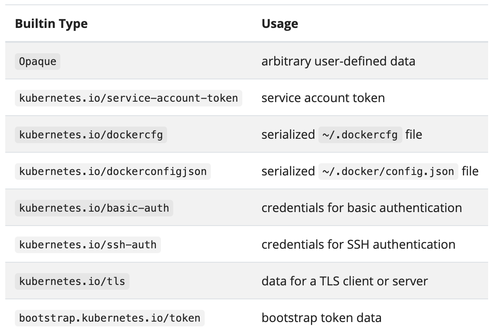
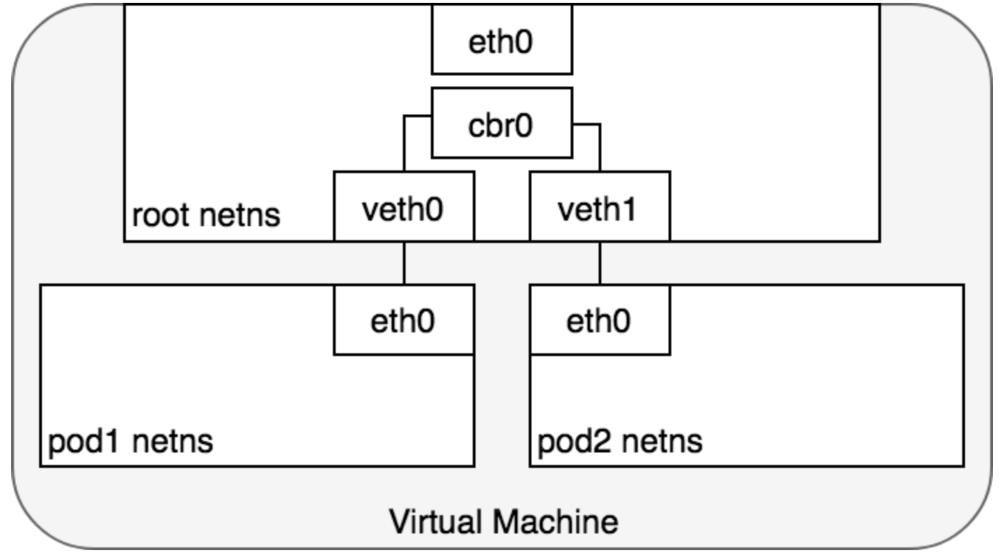
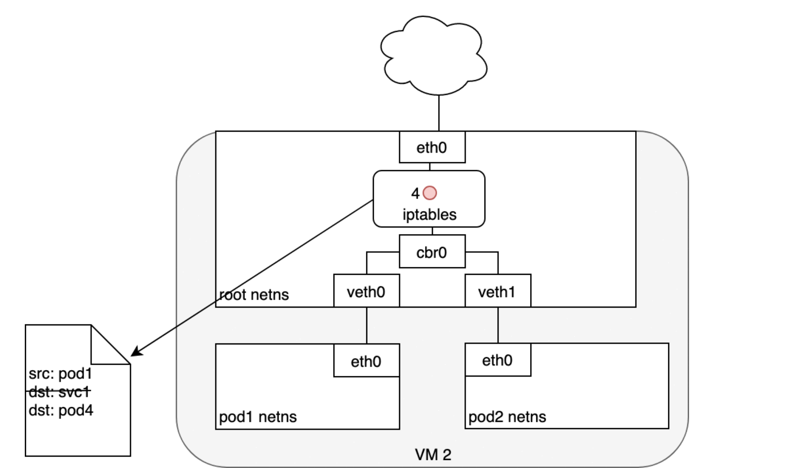

# Kubernetes

## Why use Kubernetes

## Kubernetes Architecture

## Kubernetes Objects

## Kubernetes Deployment

## Kubernetes Services

A service in Kubernetes is a REST object, similar to a pod. Services are a way of exposing an application running on a set of Pods as a network services. They are an abstraction which defines logical set of pods and a policy by which they are accessed. The set of pods targeted by a service are usually determined by a _selector_ (Allows to filter a list of resources based on label).

The default protocol for Services is TCP and also support UDP and SCTP (_Stream Control Transmission Protocol_), HTTP (_One can also use ingress instead of HTTP/HTTPS in place of HTTP service_), Proxy Protocols.

#### Service definition

```
apiVersion: v1
kind: Service
metadata:
  name: my-service
spec:
  selector:
    app: MyApp
  ports:
    - protocol: TCP
      port: 80
      targetPort: 9376
```

* Servie provides stable/static IP address which stays intact even when the pods get shuffled(destroyed/re-created)
* Provides load balancing, if we have multiple replicas of an application running in different pods, Services redirect the requests to those replicas

#### Types of Service in Kubernetes
#### Cluster IP's

* is the default type of service, i.e. if not type is specified the service of ClusterIP type will get created
* IP address gets assigned from the node's internal range, so if you have a multi node cluster the IP range for each node will be different (Example: If node1 has IP range 10.2.1.x, node2 will get 10.2.2.x and so on)
* If you want to check the pod IP, you can run `kubectl get pod -o wide` and check for the IP addresses of all the pods running in your cluster
* An ClusterIP service running will determine which pods to connect to whenever it receives a request



#### Headless Service

* Unlike ClusterIP where the service connects to the pod endpoints, the Headless services facilitates a way of directly communicating with the pod's IP
* used in stateful application/configuring database where the pod should be running for longer durations
* Can be specified by setting the ClusterIP field to None, when creating the service the DNS server will return the pod IP address instead of the service IP address

#### NodePort Service
* Set using the type field in the service configuration file, creates a service that is accessible on a static port of each worker node in the cluster
* In this type of setup we do not need to use ingress but rather connect to a dedicated worked node port to which the service is exposed to
* The node port value has a predefined range from 30000 - 32767
* NodePort service is not secure as it exposes the port to worker nodes and thus exposing the worker nodes

    ```
    apiVersion: v1
    kind: Service
    metadata:
    name: my-service
    spec:
    type: NodePort
    selector:
        app: MyApp
    ports:
        - protocol: TCP
        port: 80
        targetPort: 9376
        nodePort: 30008
    ```

#### LoadBalancer Service
 
* Exposes service externally using the cloud providers Load Balancer. NodePort and ClusterIP in this case are to which the external load balancer routes are automatically created
* The NodePort are not accessible externally but can be only accessed via Cloud LB

    ```
    apiVersion: v1
    kind: Service
    metadata:
    name: my-service
    spec:
    selector:
        app: MyApp
    ports:
        - protocol: TCP
        port: 80
        targetPort: 9376
    clusterIP: 10.0.171.239
    type: LoadBalancer
    status:
    loadBalancer:
        ingress:
        - ip: 192.0.2.127
    ```

## Kubernetes Envorionment Variables

* Kubernetes exposes certain runtime information via environment automatically, we can explicitly set environment variables for container running in a pod
* Environment variables are set using the `env` or `envForm` field in the configuration file
* Environment variable can be set using on or two ways - Using `name` and `value` pair and using `configMap`

    ```
    apiVersion: v1
    kind: Pod
    metadata:
    name: envar-demo
    labels:
        purpose: demonstrate-envars
    spec:
    containers:
    - name: envar-demo-container
        image: gcr.io/google-samples/node-hello:1.0
        env:
        - name: DEMO_GREETING
        value: "Hello from the environment"
        - name: DEMO_FAREWELL
        value: "Such a sweet sorrow"
    ```
    
## Kubernetes Config Maps

* ConfigMap is an API used to store non-confidential data in key-value pair, Pods can consume configMaps as Environment variables, command line arguments or as a configuration file in a volume
* ConfigMaps are used to inject configuration data into the containers when they start-up
* ConfigMap decouples your environment-specific configurations from your container images so that they our applications are easily portable
_Note: Config maps does not provide secrecy or encryption, if the data that needs to be stored is confidential then configMaps are not your first choice_
* configMaps are not designed to hold large data, the data stored in a configMap should not exceed 1MiB
* ConfigMap is an API object, that unlike Kubernetes objects that have a spec, configMap has `data` and `binaryData` fields

    ```
    kind: ConfigMap
    apiVersion: v1
    metadata:
    creationTimestamp: 2020-12-09
    name: example-config
    data:
    example.property.1: hello
    example.property.2: world
    example.property.file: |-
        property.1=value-1
        property.2=value-2
        property.3=value-3
    ```

* to create a configMap from a file use the following command

    ```
    kubectl create configMap game-config --from-file <file_name>
    ```

* describe a configMap

    ```kubectl describe configMaps game-config
        Name:         game-config
        Namespace:    default
        Labels:       <none>
        Annotations:  <none>

        Data
        ====
        configMapFile.yaml:
        ----
        kind: ConfigMap
        apiVersion: v1
        metadata:
        creationTimestamp: 2020-12-09
        name: example-config
        data:
        example.property.1: hello
        example.property.2: world
        example.property.file: |-
            property.1=value-1
            property.2=value-2
            property.3=value-3

        Events:  <none>
    ```

* ConfigMaps must be created before they are consumed inside the pods
* References to configMaps that do not exist will prevent the pod from starting
* ConfigMaps reside in namespace and can only be consumed by the pods in that specific namespace

## Kubernetes Secret

* Like configMaps, secret is also used to inject configuration data into containers but the only difference is that Secrets are used for storing small amount of sensitive data
* Kubernetes Secrets let you store and manage sensitive information, such as passwords, OAuth tokens, and ssh keys
* Secrets are stored in `base64-encoded` within Kubernetes, therfore they are not wildly secure
* Extremely sensitive data should be stored in vaults, for example `HashiCorp Vault` service
* creating a secret, choose a string that you want to store as a secret and convert it to base64
    ```
    echo -n 'HelloKubernetes!' | base64
    SGVsbG9LdWJlcm5ldGVzIQ==

    ```
* create a yaml file for Secret
    ```
    apiVersion: v1
    kind: Secret
    metadata:
    name: mariadb-root-password
    type: Opaque
    data:
    password: SGVsbG9LdWJlcm5ldGVzIQ==
  ```
* create the secret from the yaml file
    ```
    kubectl apply -f secret_demo.yaml
        secret/mariadb-root-password created
    ```
* describing the object
    ```
    kubectl describe secret mariadb-root-password 
        Name:         mariadb-root-password
        Namespace:    default
        Labels:       <none>
        Annotations:  <none>

        Type:  Opaque

        Data
        ====
        password:  16 bytes
    ```
* decoding a secret
    ```
    kubectl get secret mariadb-root-password -o jsonpath='{.data.password}' | base64 --decode -
        HelloKubernetes!
    ```
* When creating a secret you can specify the type that can facilitate programmatic handling of the secret
    

## Kubernetes Namespace
* Namespace provide multiple virtual clusters backed by the same physical cluster, these virtual clusters are called namespaces
* Namespace provide a scope for names. Names of resources need to be unique within a namespace but not across namespaces
* Namespaces are intended to use for use in environment with multiple users spread across multiple teams
* Namespaces are way to divide cluster resources among multiple users
* It is not necessary to use multiple namespaces just to separate slightly different namespaces, such as pods running different version of same app, in such cases use labels to distinguish the resources in same namespace
* You can list all namespaces in your cluster using the following command
    ```
    kubectl get namespaces
        NAME              STATUS   AGE
        default           Active   99d
        kube-node-lease   Active   99d
        kube-public       Active   99d
        kube-system       Active   99d
    ```
* Kubernets by default has 4 namespaces
    1. __default__: for objects with no other namespace
    2. __kube-system__: for objects created by Kubernetes system
    3. __kube-public__: reserved mostly for cluster usage and is accessible for all users(including non authenticated). This is used in case where a resource should be visible and readable across the cluster. This aspect of keeping it public is just a convention and not a requirement
    4. __kube-node-lease__: This is associated with the node object which improves the performance of the node heartbeat as the cluster scales

* Creating user-defined namespaces, creating a namespace using a yaml file
    ```
    apiVersion: v1
    kind: Namespace
    metadata:
    name: kube-demo-namespace
    ```
* command to create a namespace from this file `kubectl create -f <namepspace-yaml filename>`
* Alternatively, `kubectl create namespace <namespace-name>`
* Most of the Kubernetes resources like pods, replication controller, services and others are in namespace, however low-level objects like nodes and persistent volumes are not in any namespace
* To delete a namespace use the command `kubectl delete namespaces <namespace-name>` 

## Importance of Labels in Kubernetes

* Labels are key-value pairs that are attached to objects such as pods and services, are indented to be used to specify identifying attributes of the objects that are meaningful and relevant to users
* Labels can be used to organise subset of objects and an be attached during the creation of the object or subsequently added or modified at any time
* Each object can have set of key/value pairs but each key should be unique to the object
* Labels enable users to map their organizations structure onto system objects in a loosely coupled fashion without the clients having to store the mappings
* Syntax and character set used, the name should be 63 character of less, and can end with a alpha numeric character(a-z,0-9,A-Z), with dashes(-), (_) or . in between 
* The kubernetes.io/ and k8s.io/ prefixes are reserved for Kubernetes core components.
Example:
    ```
    kind: Pod
    metadata:
    name: label-demo
    labels:
        environment: production
        app: nginx
    spec:
    containers:
    - name: nginx
        image: nginx:1.14.2
        ports:
        - containerPort: 80
    ```
* Unlike UID's and names, labels do not provide uniqueness, it is expected many objects to carry the same labels
* Via _label selector_, the client or user can identify set of objects and the label selector is the core primitive in Kubernetes

## Kubernetes Networking 

Kubernetes networking addresses the following four concerns
1. Containers within a Pod use networking to communicate via loopback
2. Cluster networking provides communication between different Pods
3. The Service resource lets you expose an application running in Pods to be reachable from outside your cluster
4. You can also use Services to publish services only for consumption inside your cluster.

**Kubernetes dictates the following requirements on any network implementation**:
    * All pod can communicate with all other pods without using _Network Address Translation_(NAT)
    * All nodes can communicate with all pods without NAT
    * The IP that a pod sees itself as is the same IP that others see it as

Given these constraints, we're left with four distinct network problems
    1. Container to Container Networking
    2. Pod to Pod Networking
    3. Pod to Service Networking
    4. Internet to Service Networking

1. **Container to Container Networking**: In Linux, each running process communicates within a network namespace that provides a logical networking stack with its own routes, firewall rules and network devices. In essence, The network namespace provides a brand new stack for all the process in the namespace.
    * A pod is modelled as a group of containers that share a network namespace
    * Containers within the pod have same IP address and ports space assigned through the network namespace assigned to the pod, and can find each other via localhost since they reside in the same namespace

    

2. **Pod to Pod Networking**: In Kubernetes, every pod has its own realIP address and each pod communicates with other pod using that IP address. 
    * Pods exist in their own namespace that need to communicate with other namespaces on the same node or a different node
    * Namespace are connected using Linux's Virtual Ethernet Devices or veth pair consisting of two virtual devices that can be spread across multiple namespaces
    * To connect a pod's namespace one side of the veth pair is connected to the root network namespace and the other side is connected to the Pod's network namespace
    * The pods connected via veth's communicate with each other through the root namespace over a bridge. The Linux Ethernet bridge is a virtual layer 2 networking device used to unite two or more network segments, working transparently to connect two networks together

    

    * Pods running on multiple nodes: Every node in the cluster is assigned with a CIDR block specifying the IP addresses available for the pods running on that node. Once the traffic is destined for the CIDR block reaches the node, it’s the node's responsibility to forward traffic to the correct pod

3. **Pod to Service Networking**: Pod IP addresses are not durable and will get reassigned in response to scaling up or down, application crashes and node reboots. Each of these events will make a pod IP address change without any warnings. Kubernetes services address this problem
    * K8s service manages the state of set of pods, allowing to track the set of track the set of pods IP address that are dynamically changing over time. Services act as an abstraction and allow a single IP (ClusterIP) to a group of PodIP addresses
    * Kubernetes automatically creates and maintains a distributed in-cluster load balancer that distributes traffic to the Service’s associated healthy pods. 
    * **netfilters**: Netfiltering offers various functions and operations for packet filtering, NAT and port translation, which provides functionality required for directing packets through a network as well as providing the ability to prohibit packets from reaching sensitive locations with a computer system
    * **iptables**: is a user-space program providing a table-based system for defining rules for manipulating and transforming packets using the netfilter framework. In K8s, iptables rules are configured by kube-proxy controller that watched the Kubernetes API server for changes. When a change to a service or a Pods IP address occurs, the iptables rules are updated accordingly to route the traffic directed at the service to a backing pod
        
    * **IPVS**: Alternatively, one can also use IPVS (_IP Virtual Server_) for in-cluster load balancing. When declaring K8s service we can specify whether or not we want the in-cluster load balancing to be done using iptables or IPVS. IPVS has more efficient data structures(hash tables) allowing more efficient scaling capability compared to iptables. When creating IPVS three things happen
        1. A Dummy IPVS interface is created on the node
        2. The Service's IP address is bound to the dummy IPVS interface
        3. IPVS servers are created for each Service IP address
    * **DNS**: K8s can additionally use DNS to avoid having to hard code a Service's ClusterIP address into the application. Kubernetes DNS runs as are regular K8s service that is scheduled on the cluster. It configures the `kubelet` running on each node so that containers use the DNS service's IP address to resolve DNS names. The DNS pod consists of 3 separate containers
        1. **KubeDNS**: watches the Kubernetes master for change in servie and endpoints, and maintains in-memory lookup structure to serve DNS requests
        2. **dnsmasq**: adds DNS caching to improve performance
        3. **sidecar**: provides a single health check endpoint to perform health checks for `dnsmasq` and `kubedns`

4. **Internet to Service Networking**: Making your applications available to the world via web, this highlights two related concerns, (a) Getting traffic from Kubernetes service to Internet (b) getting traffic from internet to Kubernetes Service
    1. **Egress - Routing traffic to the internet**: Egress is a network policy which includes list of allowed egress rules. Each rule allows traffic that matches `to` and `ports` sections. 
            ```
            apiVersion: networking.k8s.io/v1
                kind: NetworkPolicy
                metadata:
                name: test-network-policy
                namespace: default
                ...
            egress:
                - to:
                    - ipBlock:
                    cidr: 10.0.0.0/24
                    ports:
                    - protocol: TCP
                    port: 5978
             ```
    * The example policy contains a single rule, which matches traffic on a single port (5987), to any destination in 10.0.0.0/24

        **Further explaination**
        * this ultimately depends on how the network is configured, for the sake of explanation we will consider AWS VPC(Virtual Private Cloud)
        * A K8s cluster runs within a specified VPC, where every node is assigned a Private IP address that is accessible from within the Kubernetes cluster. 
        * To make the traffic accessible from outside the cluster we need to attach an internet gateway
        * The internet gateway serves two purposes: (1) Provides a target in your VPC route table for traffic that can be routed to the internet (2) Perform NAT for any address that has been assigned a public IP
        * All the above makes the nodes available to access the internet, but the pods still have their own IP address and the Internet gateway and NAT only work with VM address as they do not have knowledge of pods running on the instance because the gateway is not container aware. 
        * The solution is to perform a source NAT i.e. changing the packet source, so that the packet appear to be coming from the VM and not the pod. With the correct source IP in place, the packet can now leave the VM and reach the internet gateway. The internet gateway will do another NAT to translate the internal IP to an external IP thus transmitting the packet to public internet

    2. **Ingress - routing internet traffic to Kubernetes**: Ingress is again a Network Policy attached to a service that includes allowed ingress rules, these rules allow traffic which matches both the `from` and `ports` sections. 
            ```
            apiVersion: networking.k8s.io/v1
                kind: NetworkPolicy
                metadata:
                name: test-network-policy
                namespace: default
                ...
                ingress:
                - from:
                    - ipBlock:
                        cidr: 172.17.0.0/16
                        except:
                        - 172.17.1.0/24
                    - namespaceSelector:
                        matchLabels:
                        project: myproject
                    - podSelector:
                        matchLabels:
                        role: frontend
                    ports:
                    - protocol: TCP
                    port: 6379
                ...
             ```
        * The policy contains a single rule, which matches traffic on single port(6379), from one of the three sources `ipBlock`, `namespaceSelector` or `podSelector`

            **Further explanation**
            * Ingress is divided into two solutions that work on different part of the network (a) Ingress: LoadBalancer, (b) Ingress Controller
            * Ingress Controller: The first step of enabling Ingress is to open a port on your service using the `NodePort` service type. To expose the node's port to the internet we need to create an Ingress object which is a higher level HTTP load balancer that maps HTTP requests in Kubernetes

#### Network Policies
* Network policies are used when you want to control the traffic flow at the IP address or port level. NetworkPolicies are application centric construct that helps you define how a pod is allowed to communicate with various network entities (endpoints/service) over the network
* Network policies are implemented using network plugins(CNI, Kubenet, etc). Creating a network policy resource without a controller that implements it has no effects
* By default pods are not isolated, they accept traffic from any source. Pods become isolated by having a NetworkPolicy. NetworkPolicies do not conflict, they are additive meaning if any policy or policies select a pod, the pod is restricted to what is allowed by the union of the those policies `ingress and egress` rules. Thus order of evaluation does not affect the policy result
* Example network policy
    ```
    apiVersion: networking.k8s.io/v1
    kind: NetworkPolicy
    metadata:
    name: test-network-policy
    namespace: default
    spec:
    podSelector:
        matchLabels:
        role: db
    policyTypes:
    - Ingress
    - Egress
    ingress:
    - from:
        - ipBlock:
            cidr: 172.17.0.0/16
            except:
            - 172.17.1.0/24
        - namespaceSelector:
            matchLabels:
            project: myproject
        - podSelector:
            matchLabels:
            role: frontend
        ports:
        - protocol: TCP
        port: 6379
    egress:
    - to:
        - ipBlock:
            cidr: 10.0.0.0/24
        ports:
        - protocol: TCP
        port: 5978
    ```
* **spec**: NetworkPolicy spec has all the information needed to  define a particular network policy in the given namespace
* **podSelector**: this selects the grouping of pods to which the policy applies, an empty pod selector selects all the pods in namespace
* **policyTypes**: this field indicates whether or not given policy applies to ingress traffic to selected pod, egress traffic from selected pod or both. If not type is specified by default `ingress` rules are applied

### Additional Netowrk Concepts
* **CoreDNS**: is a plugin that implements the Kubernetes DNS based Service Discovery Specification. Can be used to replace the kube-dns in Kubernetes cluster. CoreDNS supports only after v1.9 of the Kubernetes version
* **CNI**: adhere to the _Container Network Interface_, designed for interoperability. The CNI is selected by passing the Kubelet, the `--network-plugin=cni` command line option. 
* **Kubenet**: is a simple network plugin usually used together with a Cloud Provider that sets-up routing rules for communication between nodes. Is enabled by passing `--network-plugin=kubenet` to kubelet
* **Calico**: Calico is a container networking solution that makes use of layer 3 to route packets which utilizes the built-in Linux kernel forawarding capabilities to deliver high performance IP based networking

## Kubernetes Security
* Kubernetes security is important throughout the lifecycle of a container due to its distributed, dynamic nature. 
* Kubernetes provides innate security advantage, i.e. application container are not usually patched or updated but container images get replcaed entirely with new version. This enables strict version control and permits rapid rollback if a vulnerability is uncovered in new code
*  4C's of [Cloud Native Security](https://kubernetes.io/docs/concepts/security/overview/): Cloud, Clusters, Containers and code
    
* [Pod Security Standards](https://kubernetes.io/docs/concepts/security/pod-security-standards/) - assigning privlige and access policies to the pods(Privilidged, Default, Restricted)
* [Controlling access to Kubernetes API](https://kubernetes.io/docs/concepts/security/controlling-access/) - Transport Security(the API serves on port 443, protected by TLS), Authentication, Authorization and Admission Control
    Authorization Example
    ```
        {
            "apiVersion": "abac.authorization.kubernetes.io/v1beta1",
            "kind": "Policy",
            "spec": {
                "user": "bob",
                "namespace": "projectCaribou",
                "resource": "pods",
                "readonly": true
            }
        }
    ```

## Helm charts

## Minikube Installation and familiarization

## Handson

## Kubectl commands
