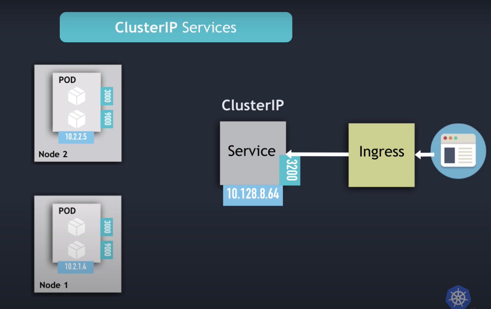
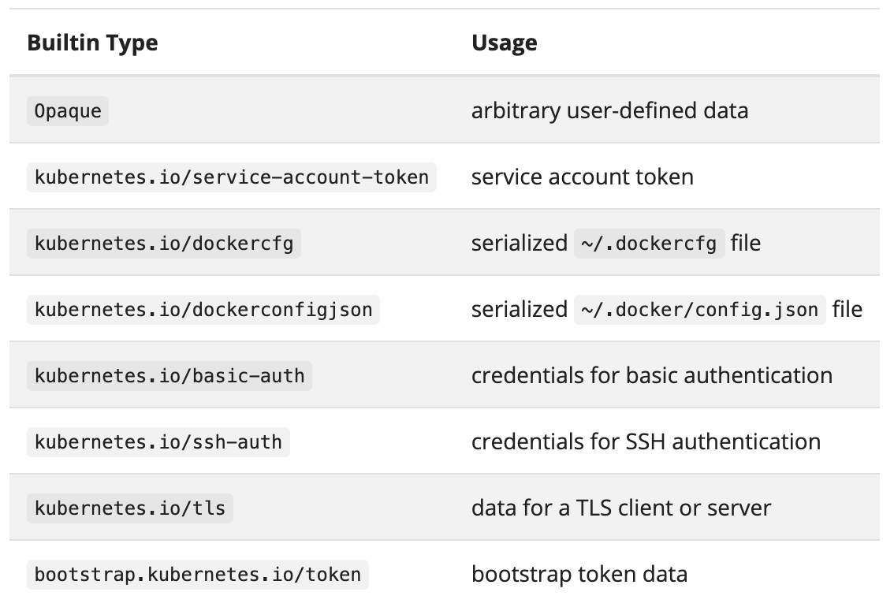
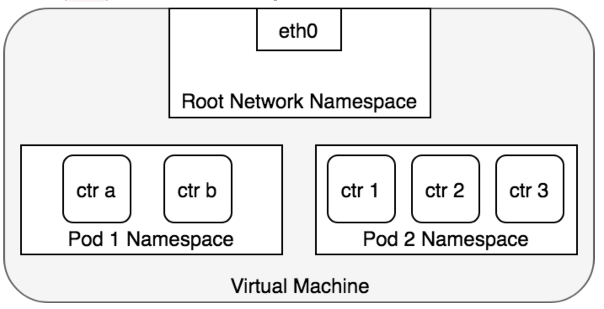
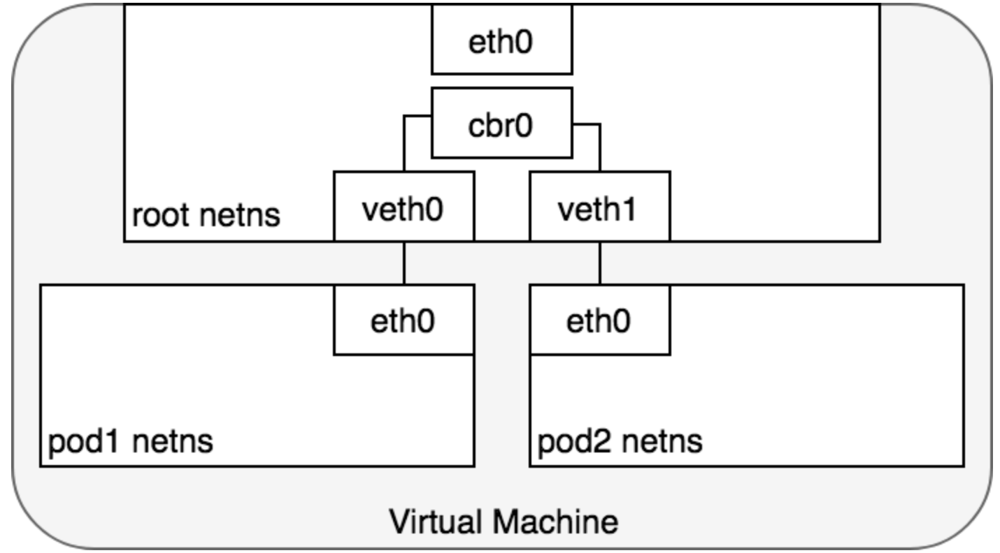
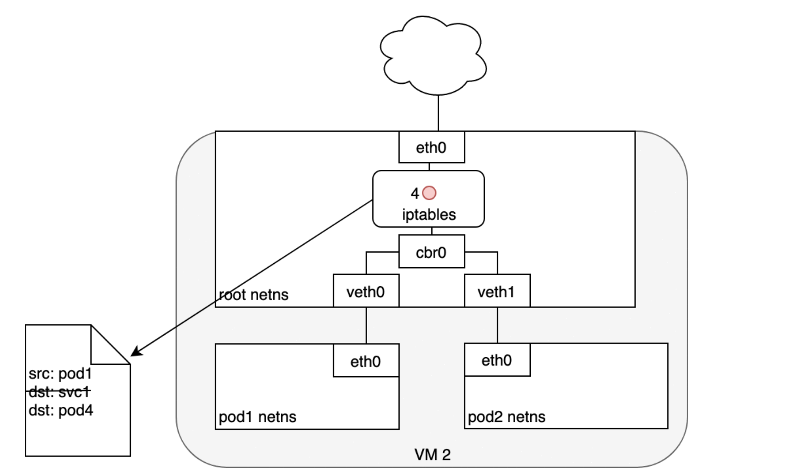
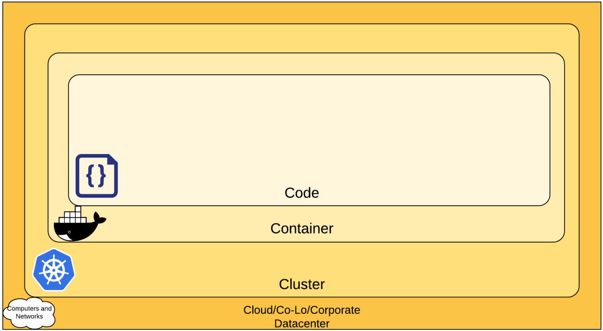

## Kubernetes
-> K8s is an Open Source, portable, extensible platform for managing containerized workloads and services that facilitate both declarative configurations and automations

-> Application-Centric Management: Raises level of abstraction from **Running an OS on virtual hardware** to **Running an app on an OS using logical resources**

-> K8s provides, **Service Discovery**, **Internal Load Balancing**, **Storage orchestration**, **Automated rollouts and Rollbacks**, **Automated Binary Packing**, **Self-Healing**, **Secret and Config Management**

-> K8s is not just an **Orchestration system**, i.e. It just not goes from A -> B -> C in sequence but it is a set of **independent**, **composable**, **control processes** that continuously drive the **current state** of the system towards the provided **desired state**

-> What K8s is not?

    * A PaaS, as K8s operates at the container level rather than the h/w level. It does provide generally applicable PaaS features such as deployments, scaling, rollouts, load balancing and lets user integrate logging, monitoring, and alerting
    * Does not limit the kind of applications, Stateless, stateful and data processing, if you can containerize an application K8s will run it for you
    * Does not deploy source code and does not build applications
    * Does not provide application level services such as, Middleware (Message buses), Data processing(Spark), Databases (MySQL), Caches, etc as built in services. Such components can run on K8s as pods or can be accessed by apps running in K8s through portable mechanism such as Open Service Broker

[Resource](https://kubernetes.io/docs/concepts/overview/what-is-kubernetes/)

___

## Kubernetes Architecture (Components)


### Master/Control Plane
-> Manages the worker nodes, pods and other resources in the cluster, Detects and responds to cluster events, Makes decision about the cluster

-> Typically consists of following components

* HA Persistent Cluster Information Store (ETCD)
* Kube-Controller-Manager
* Kube-Scheduler
* Kube-ApiServer
* Kubelet
* Container Runtime

#### ETCD
* Consistent, Distributed reliable key-value store that is Simple, Secure and Fast
* ETCD in K8s: Stores information about the cluster such as *Nodes*, *Pods*, *Configs*, *Secrets*, *Accounts*, *etc*

-> All the information that is seen as o/p of any object's get command is fetched from ETCD

-> Every change in cluster has to be updated in ETCD, a change is not complete unless it gets updated in ETCD

-> ETCD can be setup manually or as part of kubeadm

-> ETCD when initialised with Kubeadm, runs as a pod inside kube-system namespace
```
kubectl get pods -n kube-system
NAME                                       READY   STATUS     RESTARTS   AGE
coredns-66bff467f8-jr5cg                   0/1     Pending    0          5s
coredns-66bff467f8-sbcrc                   0/1     Pending    0          5s
etcd-controlplane                          1/1     Running    0          16s
katacoda-cloud-provider-5f8c798fbf-fnrxr   0/1     Pending    0          5s
kube-apiserver-controlplane                1/1     Running    0          16s
kube-controller-manager-controlplane       1/1     Running    0          16s
kube-flannel-ds-amd64-fwrmv                0/1     Init:0/1   0          6s
kube-proxy-dpq5k                           1/1     Running    0          6s
kube-scheduler-controlplane                1/1     Running    0          16s
```
```
kubectl describe pod etcd-controlplane -n kube-system
Name:                 etcd-controlplane
Namespace:            kube-system
Priority:             2000000000
Priority Class Name:  system-cluster-critical
Node:                 controlplane/172.17.0.19
Start Time:           Sun, 18 Apr 2021 14:53:33 +0000
Labels:               component=etcd
                      tier=control-plane
Annotations:          kubeadm.kubernetes.io/etcd.advertise-client-urls: https://172.17.0.19:2379
                      kubernetes.io/config.hash: 3eb0dfb7957b56160fd8dc6c42434f03
                      kubernetes.io/config.mirror: 3eb0dfb7957b56160fd8dc6c42434f03
                      kubernetes.io/config.seen: 2021-04-18T14:53:26.953255592Z
                      kubernetes.io/config.source: file
Status:               Running
IP:                   172.17.0.19
IPs:
  IP:           172.17.0.19
Controlled By:  Node/controlplane
Containers:
  etcd:
    Container ID:  docker://31d5741e3832da6a7854d60893ee57c6809dcdff133e2b3733852d1f3d669886
    Image:         k8s.gcr.io/etcd:3.4.3-0
    Image ID:      docker-pullable://k8s.gcr.io/etcd@sha256:4afb99b4690b418ffc2ceb67e1a17376457e441c1f09ab55447f0aaf992fa646
    Port:          <none>
    Host Port:     <none>
    Command:
      etcd
      --advertise-client-urls=https://172.17.0.19:2379
      --cert-file=/etc/kubernetes/pki/etcd/server.crt
      --client-cert-auth=true
      --data-dir=/var/lib/etcd
      --initial-advertise-peer-urls=https://172.17.0.19:2380
      --initial-cluster=controlplane=https://172.17.0.19:2380
      --key-file=/etc/kubernetes/pki/etcd/server.key
      --listen-client-urls=https://127.0.0.1:2379,https://172.17.0.19:2379
      --listen-metrics-urls=http://127.0.0.1:2381
      --listen-peer-urls=https://172.17.0.19:2380
      --name=controlplane
      --peer-cert-file=/etc/kubernetes/pki/etcd/peer.crt
      --peer-client-cert-auth=true
      --peer-key-file=/etc/kubernetes/pki/etcd/peer.key
      --peer-trusted-ca-file=/etc/kubernetes/pki/etcd/ca.crt
      --snapshot-count=10000
      --trusted-ca-file=/etc/kubernetes/pki/etcd/ca.crt
    State:          Running
      Started:      Sun, 18 Apr 2021 14:53:18 +0000
    Ready:          True
    Restart Count:  0
    Liveness:       http-get http://127.0.0.1:2381/health delay=15s timeout=15s period=10s #success=1 #failure=8
    Environment:    <none>
    Mounts:
      /etc/kubernetes/pki/etcd from etcd-certs (rw)
      /var/lib/etcd from etcd-data (rw)
Conditions:
  Type              Status
  Initialized       True
  Ready             True
  ContainersReady   True
  PodScheduled      True
Volumes:
  etcd-certs:
    Type:          HostPath (bare host directory volume)
    Path:          /etc/kubernetes/pki/etcd
    HostPathType:  DirectoryOrCreate
  etcd-data:
    Type:          HostPath (bare host directory volume)
    Path:          /var/lib/etcd
    HostPathType:  DirectoryOrCreate
QoS Class:         BestEffort
Node-Selectors:    <none>
Tolerations:       :NoExecute
Events:            <none>
```
-> Running ETCD commands on the ETCD pods
```
kubectl exec etcd-controlplane -n kube-system  -- etcdctl check perf
```
-> ETCD if needed to be installed manually, one needs to download binary and install them on the nodes

-> The etcd.service settings, ETCD runs on 2379 port, and to set this the **–advertise-client-urls** configuration file should be set to Internal_IP of the node with 2379 exposed.

-> Additional to that, if a HA cluster setup we need to set the **–initial-cluster** flag set to other ETCD nodes listening to 2380 port
In Manager K8s, there is a seperate HA ETCD cluster setup to store K8s cluster information, Example:
```
kubectl get nodes | grep etcd
etcd-k8s-corp-mid-us-corp-kc-8a-192-168-8-15.novalocal    Ready      <none>   95d   v1.18.10
etcd-k8s-corp-mid-us-corp-kc-8a-192-168-8-5.novalocal     Ready      <none>   95d   v1.18.10
etcd-k8s-corp-mid-us-corp-kc-8b-192-168-24-8.novalocal    Ready      <none>   95d   v1.18.10
etcd-k8s-corp-mid-us-corp-kc-8c-192-168-40-11.novalocal   Ready      <none>   95d   v1.18.10
etcd-k8s-corp-mid-us-corp-kc-8c-192-168-40-7.novalocal    Ready      <none>   95d   v1.18.1
```
[ETCD Resources](https://etcd.io/docs/v3.4/learning/)

#### Kube-Controller
-> Component that runs the controller processes. Logically, each controller is a separate process but to reduce the complexity they are compiled into a single binary and run as a single process

* **Node Controller**: Responsible for noticing and responding to node events - checks the status of the node every 5(2s for Managed K8s) seconds, if the node does not respond to the heartbeat it is deemed to be unreachable  after a Node Monitor Grace Period of 40(20s for Managed K8s) seconds. It is then given 5 minutes to come back up, if it does not then the pods on the node are evicted (Pod eviction is not set for Managed K8s)
* **Replication Controller**: responsible for maintaining the correct number(desired) of pods for every replication object in system
* **Endpoint Controller**: populates the endpoint objects, i.e. joins the services to the pods
* **Service account and Token Controllers**: create default accounts and API accesses for the new namespaces

```
kubectl describe pod kube-controller-manager-controlplane -n kube-system
Name:                 kube-controller-manager-controlplane
Namespace:            kube-system
Priority:             2000000000
Priority Class Name:  system-cluster-critical
Node:                 controlplane/172.17.0.19
Start Time:           Sun, 18 Apr 2021 14:53:33 +0000
Labels:               component=kube-controller-manager
                      tier=control-plane
Annotations:          kubernetes.io/config.hash: f9b9c6969be80756638e9cf4927b5881
                      kubernetes.io/config.mirror: f9b9c6969be80756638e9cf4927b5881
                      kubernetes.io/config.seen: 2021-04-18T14:53:26.953264743Z
                      kubernetes.io/config.source: file
Status:               Running
IP:                   172.17.0.19
IPs:
  IP:           172.17.0.19
Controlled By:  Node/controlplane
Containers:
  kube-controller-manager:
    Container ID:  docker://37f99f5a1b9005d2024907989364f35c8af6427e2c97f63f11a1f1d94547a570
    Image:         k8s.gcr.io/kube-controller-manager:v1.18.0
    Image ID:      docker-pullable://k8s.gcr.io/kube-controller-manager@sha256:d926b172b8fc3568d8eab9736b2f79a1afefcb809d030dd4465cbb0d444ce293
    Port:          <none>
    Host Port:     <none>
    Command:
      kube-controller-manager
      --allocate-node-cidrs=true
      --authentication-kubeconfig=/etc/kubernetes/controller-manager.conf
      --authorization-kubeconfig=/etc/kubernetes/controller-manager.conf
      --bind-address=127.0.0.1
      --client-ca-file=/etc/kubernetes/pki/ca.crt
      --cluster-cidr=10.244.0.0/16
      --cluster-name=kubernetes
      --cluster-signing-cert-file=/etc/kubernetes/pki/ca.crt
      --cluster-signing-key-file=/etc/kubernetes/pki/ca.key
      --controllers=*,bootstrapsigner,tokencleaner
      --kubeconfig=/etc/kubernetes/controller-manager.conf
      --leader-elect=true
      --node-cidr-mask-size=24
      --requestheader-client-ca-file=/etc/kubernetes/pki/front-proxy-ca.crt
      --root-ca-file=/etc/kubernetes/pki/ca.crt
      --service-account-private-key-file=/etc/kubernetes/pki/sa.key
      --service-cluster-ip-range=10.96.0.0/12
      --use-service-account-credentials=true
    State:          Running
      Started:      Sun, 18 Apr 2021 14:53:18 +0000
    Ready:          True
    Restart Count:  0
    Requests:
      cpu:        200m
    Liveness:     http-get https://127.0.0.1:10257/healthz delay=15s timeout=15s period=10s #success=1 #failure=8
    Environment:  <none>
    Mounts:
      /etc/ca-certificates from etc-ca-certificates (ro)
      /etc/kubernetes/controller-manager.conf from kubeconfig (ro)
      /etc/kubernetes/pki from k8s-certs (ro)
      /etc/ssl/certs from ca-certs (ro)
      /usr/libexec/kubernetes/kubelet-plugins/volume/exec from flexvolume-dir (rw)
      /usr/local/share/ca-certificates from usr-local-share-ca-certificates (ro)
      /usr/share/ca-certificates from usr-share-ca-certificates (ro)
Conditions:
  Type              Status
  Initialized       True
  Ready             True
  ContainersReady   True
  PodScheduled      True
Volumes:
  ca-certs:
    Type:          HostPath (bare host directory volume)
    Path:          /etc/ssl/certs
    HostPathType:  DirectoryOrCreate
  etc-ca-certificates:
    Type:          HostPath (bare host directory volume)
    Path:          /etc/ca-certificates
    HostPathType:  DirectoryOrCreate
  flexvolume-dir:
    Type:          HostPath (bare host directory volume)
    Path:          /usr/libexec/kubernetes/kubelet-plugins/volume/exec
    HostPathType:  DirectoryOrCreate
  k8s-certs:
    Type:          HostPath (bare host directory volume)
    Path:          /etc/kubernetes/pki
    HostPathType:  DirectoryOrCreate
  kubeconfig:
    Type:          HostPath (bare host directory volume)
    Path:          /etc/kubernetes/controller-manager.conf
    HostPathType:  FileOrCreate
  usr-local-share-ca-certificates:
    Type:          HostPath (bare host directory volume)
    Path:          /usr/local/share/ca-certificates
    HostPathType:  DirectoryOrCreate
  usr-share-ca-certificates:
    Type:          HostPath (bare host directory volume)
    Path:          /usr/share/ca-certificates
    HostPathType:  DirectoryOrCreate
QoS Class:         Burstable
Node-Selectors:    <none>
Tolerations:       :NoExecute
Events:            <none>
```

[Controller Resource](https://kubernetes.io/docs/concepts/architecture/controller/)

#### Kube-Scheduler
-> component that watches for newly created pods with no nodes assigned and assigns a node to them

-> Factors taken into consideration during node assignment:
* Individual and collective resources requirements
* Hardware/Software/Policy constraints
* Affinity and Anti-Affinity specifications
* Data locality
* inter-workload interference
* deadlines

-> Kube-scheduler steps in deciding on a node depending on resources
1. The Kube-Scheduler first **filters** the node depending on the pod resource requirement, for example the CPU requirement of container is 8 CPU and your cluster has a mixture of nodes with 4, 4, 10, 16 CPU's, the scheduler filters out 4, 4
2. The kube-scheduler then ranks the node depending between 0 - 10 depending on how much resource will be available on the node once the pod is assigned to it, in our example, if the pod is assigned to node with 10 CPU's, 2 will be available and if it is assigned to node with 16, 8 CPU's will still be available so the scheduler ranks the last node as highest and spins up the pod on it

```
kubectl describe pod kube-scheduler-controlplane -n kube-system
Name:                 kube-scheduler-controlplane
Namespace:            kube-system
Priority:             2000000000
Priority Class Name:  system-cluster-critical
Node:                 controlplane/172.17.0.45
Start Time:           Sun, 18 Apr 2021 16:03:07 +0000
Labels:               component=kube-scheduler
                      tier=control-plane
Annotations:          kubernetes.io/config.hash: 5795d0c442cb997ff93c49feeb9f6386
                      kubernetes.io/config.mirror: 5795d0c442cb997ff93c49feeb9f6386
                      kubernetes.io/config.seen: 2021-04-18T16:03:00.720619905Z
                      kubernetes.io/config.source: file
Status:               Running
IP:                   172.17.0.45
IPs:
  IP:           172.17.0.45
Controlled By:  Node/controlplane
Containers:
  kube-scheduler:
    Container ID:  docker://a8b024679b9c642dc1452339f51d12377929c9ea7d6bd3dbf1344bdabcf85b58
    Image:         k8s.gcr.io/kube-scheduler:v1.18.0
    Image ID:      docker-pullable://k8s.gcr.io/kube-scheduler@sha256:33063bc856e99d12b9cb30aab1c1c755ecd458d5bd130270da7c51c70ca10cf6
    Port:          <none>
    Host Port:     <none>
    Command:
      kube-scheduler
      --authentication-kubeconfig=/etc/kubernetes/scheduler.conf
      --authorization-kubeconfig=/etc/kubernetes/scheduler.conf
      --bind-address=127.0.0.1
      --kubeconfig=/etc/kubernetes/scheduler.conf
      --leader-elect=true
    State:          Running
      Started:      Sun, 18 Apr 2021 16:02:51 +0000
    Ready:          True
    Restart Count:  0
    Requests:
      cpu:        100m
    Liveness:     http-get https://127.0.0.1:10259/healthz delay=15s timeout=15s period=10s #success=1 #failure=8
    Environment:  <none>
    Mounts:
      /etc/kubernetes/scheduler.conf from kubeconfig (ro)
Conditions:
  Type              Status
  Initialized       True
  Ready             True
  ContainersReady   True
  PodScheduled      True
Volumes:
  kubeconfig:
    Type:          HostPath (bare host directory volume)
    Path:          /etc/kubernetes/scheduler.conf
    HostPathType:  FileOrCreate
QoS Class:         Burstable
Node-Selectors:    <none>
Tolerations:       :NoExecute
Events:            <none>
```

#### Kube-ApiServer
-> Primary Management component in K8s. It is at the centre of sll the different tasks that need to be performed in the K8s cluster. The kube-api server services the REST operations and provides frontend to the clusters shared state through which all other components interact.

-> kube-api primary operations:
* Authenticate user
* Validate request
* Retrieve data
* Update ETCD: api-server is the only component that can directly Interact with ETCD
* Scheduler  }
* Kubectl    } uses the api-server to preform updates in the cluster
* Kubelet    }

-> Configurations that enable the kube-ApiServer to communicate with all the other components
```
kubectl describe pod kube-apiserver-controlplane -n kube-system
Name:                 kube-apiserver-controlplane
Namespace:            kube-system
Priority:             2000000000
Priority Class Name:  system-cluster-critical
Node:                 controlplane/172.17.0.19
Start Time:           Sun, 18 Apr 2021 14:53:34 +0000
Labels:               component=kube-apiserver
                      tier=control-plane
Annotations:          kubeadm.kubernetes.io/kube-apiserver.advertise-address.endpoint: 172.17.0.19:6443
                      kubernetes.io/config.hash: 139c277e532b7558af5419b2dc2e6d7a
                      kubernetes.io/config.mirror: 139c277e532b7558af5419b2dc2e6d7a
                      kubernetes.io/config.seen: 2021-04-18T14:53:26.953263064Z
                      kubernetes.io/config.source: file
Status:               Running
IP:                   172.17.0.19
IPs:
  IP:           172.17.0.19
Controlled By:  Node/controlplane
Containers:
  kube-apiserver:
    Container ID:  docker://e317a0026edc330125e4dacf3359503d11011833a829835bbbc4698263b643d0
    Image:         k8s.gcr.io/kube-apiserver:v1.18.0
    Image ID:      docker-pullable://k8s.gcr.io/kube-apiserver@sha256:fc4efb55c2a7d4e7b9a858c67e24f00e739df4ef5082500c2b60ea0903f18248
    Port:          <none>
    Host Port:     <none>
    Command:
      kube-apiserver
      --advertise-address=172.17.0.19
      --allow-privileged=true
      --authorization-mode=Node,RBAC
      --client-ca-file=/etc/kubernetes/pki/ca.crt
      --enable-admission-plugins=NodeRestriction
      --enable-bootstrap-token-auth=true
      --etcd-cafile=/etc/kubernetes/pki/etcd/ca.crt
      --etcd-certfile=/etc/kubernetes/pki/apiserver-etcd-client.crt
      --etcd-keyfile=/etc/kubernetes/pki/apiserver-etcd-client.key
      --etcd-servers=https://127.0.0.1:2379
      --insecure-port=0
      --kubelet-client-certificate=/etc/kubernetes/pki/apiserver-kubelet-client.crt
      --kubelet-client-key=/etc/kubernetes/pki/apiserver-kubelet-client.key
      --kubelet-preferred-address-types=InternalIP,ExternalIP,Hostname
      --proxy-client-cert-file=/etc/kubernetes/pki/front-proxy-client.crt
      --proxy-client-key-file=/etc/kubernetes/pki/front-proxy-client.key
      --requestheader-allowed-names=front-proxy-client
      --requestheader-client-ca-file=/etc/kubernetes/pki/front-proxy-ca.crt
      --requestheader-extra-headers-prefix=X-Remote-Extra-
      --requestheader-group-headers=X-Remote-Group
      --requestheader-username-headers=X-Remote-User
      --secure-port=6443
      --service-account-key-file=/etc/kubernetes/pki/sa.pub
      --service-cluster-ip-range=10.96.0.0/12
      --tls-cert-file=/etc/kubernetes/pki/apiserver.crt
      --tls-private-key-file=/etc/kubernetes/pki/apiserver.key
    State:          Running
      Started:      Sun, 18 Apr 2021 14:53:18 +0000
    Ready:          True
    Restart Count:  0
    Requests:
      cpu:        250m
    Liveness:     http-get https://172.17.0.19:6443/healthz delay=15s timeout=15s period=10s #success=1 #failure=8
    Environment:  <none>
    Mounts:
      /etc/ca-certificates from etc-ca-certificates (ro)
      /etc/kubernetes/pki from k8s-certs (ro)
      /etc/ssl/certs from ca-certs (ro)
      /usr/local/share/ca-certificates from usr-local-share-ca-certificates (ro)
      /usr/share/ca-certificates from usr-share-ca-certificates (ro)
Conditions:
  Type              Status
  Initialized       True
  Ready             True
  ContainersReady   True
  PodScheduled      True
Volumes:
  ca-certs:
    Type:          HostPath (bare host directory volume)
    Path:          /etc/ssl/certs
    HostPathType:  DirectoryOrCreate
  etc-ca-certificates:
    Type:          HostPath (bare host directory volume)
    Path:          /etc/ca-certificates
    HostPathType:  DirectoryOrCreate
  k8s-certs:
    Type:          HostPath (bare host directory volume)
    Path:          /etc/kubernetes/pki
    HostPathType:  DirectoryOrCreate
  usr-local-share-ca-certificates:
    Type:          HostPath (bare host directory volume)
    Path:          /usr/local/share/ca-certificates
    HostPathType:  DirectoryOrCreate
  usr-share-ca-certificates:
    Type:          HostPath (bare host directory volume)
    Path:          /usr/share/ca-certificates
    HostPathType:  DirectoryOrCreate
QoS Class:         Burstable
Node-Selectors:    <none>
Tolerations:       :NoExecute
Events:            <none>
controlplane $ kubectl describe pod kube-apiserver-controlplane -n kube-system
Name:                 kube-apiserver-controlplane
Namespace:            kube-system
Priority:             2000000000
Priority Class Name:  system-cluster-critical
Node:                 controlplane/172.17.0.19
Start Time:           Sun, 18 Apr 2021 14:53:34 +0000
Labels:               component=kube-apiserver
                      tier=control-plane
Annotations:          kubeadm.kubernetes.io/kube-apiserver.advertise-address.endpoint: 172.17.0.19:6443
                      kubernetes.io/config.hash: 139c277e532b7558af5419b2dc2e6d7a
                      kubernetes.io/config.mirror: 139c277e532b7558af5419b2dc2e6d7a
                      kubernetes.io/config.seen: 2021-04-18T14:53:26.953263064Z
                      kubernetes.io/config.source: file
Status:               Running
IP:                   172.17.0.19
IPs:
  IP:           172.17.0.19
Controlled By:  Node/controlplane
Containers:
  kube-apiserver:
    Container ID:  docker://e317a0026edc330125e4dacf3359503d11011833a829835bbbc4698263b643d0
    Image:         k8s.gcr.io/kube-apiserver:v1.18.0
    Image ID:      docker-pullable://k8s.gcr.io/kube-apiserver@sha256:fc4efb55c2a7d4e7b9a858c67e24f00e739df4ef5082500c2b60ea0903f18248
    Port:          <none>
    Host Port:     <none>
    Command:
      kube-apiserver
      --advertise-address=172.17.0.19
      --allow-privileged=true
      --authorization-mode=Node,RBAC
      --client-ca-file=/etc/kubernetes/pki/ca.crt
      --enable-admission-plugins=NodeRestriction
      --enable-bootstrap-token-auth=true
      --etcd-cafile=/etc/kubernetes/pki/etcd/ca.crt
      --etcd-certfile=/etc/kubernetes/pki/apiserver-etcd-client.crt
      --etcd-keyfile=/etc/kubernetes/pki/apiserver-etcd-client.key
      --etcd-servers=https://127.0.0.1:2379
      --insecure-port=0
      --kubelet-client-certificate=/etc/kubernetes/pki/apiserver-kubelet-client.crt
      --kubelet-client-key=/etc/kubernetes/pki/apiserver-kubelet-client.key
      --kubelet-preferred-address-types=InternalIP,ExternalIP,Hostname
      --proxy-client-cert-file=/etc/kubernetes/pki/front-proxy-client.crt
      --proxy-client-key-file=/etc/kubernetes/pki/front-proxy-client.key
      --requestheader-allowed-names=front-proxy-client
      --requestheader-client-ca-file=/etc/kubernetes/pki/front-proxy-ca.crt
      --requestheader-extra-headers-prefix=X-Remote-Extra-
      --requestheader-group-headers=X-Remote-Group
      --requestheader-username-headers=X-Remote-User
      --secure-port=6443
      --service-account-key-file=/etc/kubernetes/pki/sa.pub
      --service-cluster-ip-range=10.96.0.0/12
      --tls-cert-file=/etc/kubernetes/pki/apiserver.crt
      --tls-private-key-file=/etc/kubernetes/pki/apiserver.key
    State:          Running
      Started:      Sun, 18 Apr 2021 14:53:18 +0000
    Ready:          True
    Restart Count:  0
    Requests:
      cpu:        250m
    Liveness:     http-get https://172.17.0.19:6443/healthz delay=15s timeout=15s period=10s #success=1 #failure=8
    Environment:  <none>
    Mounts:
      /etc/ca-certificates from etc-ca-certificates (ro)
      /etc/kubernetes/pki from k8s-certs (ro)
      /etc/ssl/certs from ca-certs (ro)
      /usr/local/share/ca-certificates from usr-local-share-ca-certificates (ro)
      /usr/share/ca-certificates from usr-share-ca-certificates (ro)
Conditions:
  Type              Status
  Initialized       True
  Ready             True
  ContainersReady   True
  PodScheduled      True
Volumes:
  ca-certs:
    Type:          HostPath (bare host directory volume)
    Path:          /etc/ssl/certs
    HostPathType:  DirectoryOrCreate
  etc-ca-certificates:
    Type:          HostPath (bare host directory volume)
    Path:          /etc/ca-certificates
    HostPathType:  DirectoryOrCreate
  k8s-certs:
    Type:          HostPath (bare host directory volume)
    Path:          /etc/kubernetes/pki
    HostPathType:  DirectoryOrCreate
  usr-local-share-ca-certificates:
    Type:          HostPath (bare host directory volume)
    Path:          /usr/local/share/ca-certificates
    HostPathType:  DirectoryOrCreate
  usr-share-ca-certificates:
    Type:          HostPath (bare host directory volume)
    Path:          /usr/share/ca-certificates
    HostPathType:  DirectoryOrCreate
QoS Class:         Burstable
Node-Selectors:    <none>
Tolerations:       :NoExecute
Events:            <none>
controlplane $
```

Example: Operations performed by api-server when it recieves Pod creation Request
1. Request is authenticated and validated
2. Kube-api server creates the pod without assigning a node and updates the information in ETCD cluster and to the user that pod is created
3. Scheduler, continuously monitoring the api-server, realizes that there is a new pod to which no node has been assigned yet. Scheduler identifies the right node to place the pod and communicates to the api-server
4. The api-server then updates the information in the ETCD servers
5. Api-server then passes the information to the nodes Kubelet service, Kubelet service then creates the pod on the node and instructs the container runtime engine to deploy the application image
6. Once the Kubelet updates the status back to the api-server, the data is updated back in the ETCD by api-server

[Kube-api-reference](https://kubernetes.io/docs/reference/command-line-tools-reference/kube-apiserver/)

## Worker Nodes
-> Machines were all the containerized applications run

-> Each node is managed by control plane and container **Kubelet**, **Container Runtime** and **Kube-proxy** to run the container workload

-> There are two ways to add a new node to the cluster
1. Kubelet on a node self-registers the node to control plane
2. You manually add the node to the cluster using the bootstrapping command

Node manifest file example
```
{
  "apiVersion": "v1",
  "kind": "Node",
  "metadata": {
    "name": "10.240.79.157",
    "labels": {
      "name": "my-first-k8s-node"
    }
  }
}
```

#### Kubelet
-> Kubelet is an agent service running on each node and makes sure that the containers are running in their respective pods

-> The kubelet takes set of PodSpecs that are provided through various mechanism (Pod, Deployment, Replicaset) and ensures that the containers described in the PopSpecs are running and healthy

-> The Kubelet does not manage the containers that were not created by k8s

-> Kubelet on nodes is managed as a service under systemctl

#### Kube-proxy
-> Is a network proxy that runs on each node in a cluster, implementing part of K8s service concept

-> Kube-proxy maintains network rules on nodes. These network rules allow network communication between pods from inside or outside the cluster

-> Kube-proxy uses the OS system packet filtering later if there's one and is available for use else it forwards traffic by itself

```
kubectl describe pod kube-proxy-f4m25 -n kube-system
Name:                 kube-proxy-f4m25
Namespace:            kube-system
Priority:             2000001000
Priority Class Name:  system-node-critical
Node:                 node01/172.17.0.16
Start Time:           Sun, 18 Apr 2021 23:38:35 +0000
Labels:               controller-revision-hash=c8bb659c5
                      k8s-app=kube-proxy
                      pod-template-generation=1
Annotations:          <none>
Status:               Running
IP:                   172.17.0.16
IPs:
  IP:           172.17.0.16
Controlled By:  DaemonSet/kube-proxy
Containers:
  kube-proxy:
    Container ID:  docker://d3251a752f8539a77a765336bdfe19bfb7ef7c8c1d64d30ca54853470a66872e
    Image:         k8s.gcr.io/kube-proxy:v1.18.0
    Image ID:      docker-pullable://k8s.gcr.io/kube-proxy@sha256:9e858386d52d0abaf936c1d10a763648ab7d85c8eb0af08a50a64238146e5571
    Port:          <none>
    Host Port:     <none>
    Command:
      /usr/local/bin/kube-proxy
      --config=/var/lib/kube-proxy/config.conf
      --hostname-override=$(NODE_NAME)
    State:          Running
      Started:      Sun, 18 Apr 2021 23:38:41 +0000
    Ready:          True
    Restart Count:  0
    Environment:
      NODE_NAME:   (v1:spec.nodeName)
    Mounts:
      /lib/modules from lib-modules (ro)
      /run/xtables.lock from xtables-lock (rw)
      /var/lib/kube-proxy from kube-proxy (rw)
      /var/run/secrets/kubernetes.io/serviceaccount from kube-proxy-token-mvckr (ro)
Conditions:
  Type              Status
  Initialized       True
  Ready             True
  ContainersReady   True
  PodScheduled      True
Volumes:
  kube-proxy:
    Type:      ConfigMap (a volume populated by a ConfigMap)
    Name:      kube-proxy
    Optional:  false
  xtables-lock:
    Type:          HostPath (bare host directory volume)
    Path:          /run/xtables.lock
    HostPathType:  FileOrCreate
  lib-modules:
    Type:          HostPath (bare host directory volume)
    Path:          /lib/modules
    HostPathType:  
  kube-proxy-token-mvckr:
    Type:        Secret (a volume populated by a Secret)
    SecretName:  kube-proxy-token-mvckr
    Optional:    false
QoS Class:       BestEffort
Node-Selectors:  kubernetes.io/os=linux
Tolerations:     
                 CriticalAddonsOnly
                 node.kubernetes.io/disk-pressure:NoSchedule
                 node.kubernetes.io/memory-pressure:NoSchedule
                 node.kubernetes.io/network-unavailable:NoSchedule
                 node.kubernetes.io/not-ready:NoExecute
                 node.kubernetes.io/pid-pressure:NoSchedule
                 node.kubernetes.io/unreachable:NoExecute
                 node.kubernetes.io/unschedulable:NoSchedule
Events:
  Type    Reason     Age   From               Message
  ----    ------     ----  ----               -------
  Normal  Scheduled  22m   default-scheduler  Successfully assigned kube-system/kube-proxy-f4m25 to node01
  Normal  Pulling    22m   kubelet, node01    Pulling image "k8s.gcr.io/kube-proxy:v1.18.0"
  Normal  Pulled     21m   kubelet, node01    Successfully pulled image "k8s.gcr.io/kube-proxy:v1.18.0"
  Normal  Created    21m   kubelet, node01    Created container kube-proxy
  Normal  Started    21m   kubelet, node01    Started container kube-proxy
```

#### Container Runtime
-> Service that enables a node to run containers

-> Usually Docker, but supports continaerd, CRI-O, RKT

[Resource](https://kubernetes.io/docs/concepts/overview/components/)
___
## Kubernetes Objects and Manifest file
-> The core of K8s control plane is the api-server, it exposes an HTTP Api that lets end users, different part of our K8s cluster and external components communicate with one another

-> The K8s api lets us query and manipulate the stare of API objects in K8s

-> The API objects are persistent entities in the K8s system

-> K8s uses these entities to represent the state of the cluster

-> K8s api-objects are express in manifest file, in YAML format

-> A K8s object is a "**Record of intent**", once the object is created K8s constantly works to ensure the object and its intended state exists, also called as desired state

-> Every K8s API object includes two nested object fields that govern the object configuration
1. Spec: We have to set this when we create an object providing a description of characteristics we want the resources to have: Desired state
2. Status: describes the current state of the object supplied and updated by the K8s system and its components. K8s control plane constantly and actively manages the object's actual(current) state to match the desired state

-> Most often this information is provided to **Kubectl** in an yaml file, Kubectl converts the information to JSON when making API request

-> Every objects yaml file contains the following required fields
1. apiVersion: version of K8s api used to create the object
```
kubectl api-versions
acme.cert-manager.io/v1alpha2
acme.cert-manager.io/v1alpha3
admissionregistration.k8s.io/v1
admissionregistration.k8s.io/v1beta1
apiextensions.k8s.io/v1
apiextensions.k8s.io/v1beta1
apiregistration.k8s.io/v1
apiregistration.k8s.io/v1beta1
apps/v1
authentication.k8s.io/v1
authentication.k8s.io/v1beta1
authorization.k8s.io/v1
authorization.k8s.io/v1beta1
autoscaling/v1
autoscaling/v2beta1
autoscaling/v2beta2
batch/v1
batch/v1beta1
bitnami.com/v1alpha1
cert-manager.io/v1alpha2
cert-manager.io/v1alpha3
certificates.k8s.io/v1beta1
coordination.k8s.io/v1
coordination.k8s.io/v1beta1
crd.projectcalico.org/v1
dex.coreos.com/v1
discovery.k8s.io/v1beta1
events.k8s.io/v1beta1
extensions/v1beta1
jenkins.io/v1alpha1
jenkins.io/v1alpha2
metrics.k8s.io/v1beta1
monitoring.coreos.com/v1
monitoring.coreos.com/v1alpha1
networking.k8s.io/v1
networking.k8s.io/v1beta1
node.k8s.io/v1beta1
ops.alexellis.io/v1
policy/v1beta1
rbac.authorization.k8s.io/v1
rbac.authorization.k8s.io/v1beta1
scheduling.k8s.io/v1
scheduling.k8s.io/v1beta1
storage.k8s.io/v1
storage.k8s.io/v1beta1
v1
```
2. kind: the kind of object being created
```
kubectl api-resources
NAME                              SHORTNAMES   APIGROUP                       NAMESPACED   KIND
bindings                                                                      true         Binding
componentstatuses                 cs                                          false        ComponentStatus
configmaps                        cm                                          true         ConfigMap
endpoints                         ep                                          true         Endpoints
events                            ev                                          true         Event
limitranges                       limits                                      true         LimitRange
namespaces                        ns                                          false        Namespace
nodes                             no                                          false        Node
persistentvolumeclaims            pvc                                         true         PersistentVolumeClaim
persistentvolumes                 pv                                          false        PersistentVolume
pods                              po                                          true         Pod
podtemplates                                                                  true         PodTemplate
replicationcontrollers            rc                                          true         ReplicationController
resourcequotas                    quota                                       true         ResourceQuota
secrets                                                                       true         Secret
serviceaccounts                   sa                                          true         ServiceAccount
services                          svc                                         true         Service
challenges                                     acme.cert-manager.io           true         Challenge
orders                                         acme.cert-manager.io           true         Order
mutatingwebhookconfigurations                  admissionregistration.k8s.io   false        MutatingWebhookConfiguration
validatingwebhookconfigurations                admissionregistration.k8s.io   false        ValidatingWebhookConfiguration
customresourcedefinitions         crd,crds     apiextensions.k8s.io           false        CustomResourceDefinition
apiservices                                    apiregistration.k8s.io         false        APIService
controllerrevisions                            apps                           true         ControllerRevision
daemonsets                        ds           apps                           true         DaemonSet
deployments                       deploy       apps                           true         Deployment
replicasets                       rs           apps                           true         ReplicaSet
statefulsets                      sts          apps                           true         StatefulSet
tokenreviews                                   authentication.k8s.io          false        TokenReview
localsubjectaccessreviews                      authorization.k8s.io           true         LocalSubjectAccessReview
selfsubjectaccessreviews                       authorization.k8s.io           false        SelfSubjectAccessReview
selfsubjectrulesreviews                        authorization.k8s.io           false        SelfSubjectRulesReview
subjectaccessreviews                           authorization.k8s.io           false        SubjectAccessReview
horizontalpodautoscalers          hpa          autoscaling                    true         HorizontalPodAutoscaler
cronjobs                          cj           batch                          true         CronJob
jobs                                           batch                          true         Job
sealedsecrets                                  bitnami.com                    true         SealedSecret
certificaterequests               cr,crs       cert-manager.io                true         CertificateRequest
certificates                      cert,certs   cert-manager.io                true         Certificate
clusterissuers                                 cert-manager.io                false        ClusterIssuer
issuers                                        cert-manager.io                true         Issuer
certificatesigningrequests        csr          certificates.k8s.io            false        CertificateSigningRequest
leases                                         coordination.k8s.io            true         Lease
bgpconfigurations                              crd.projectcalico.org          false        BGPConfiguration
clusterinformations                            crd.projectcalico.org          false        ClusterInformation
felixconfigurations                            crd.projectcalico.org          false        FelixConfiguration
globalnetworkpolicies                          crd.projectcalico.org          false        GlobalNetworkPolicy
globalnetworksets                              crd.projectcalico.org          false        GlobalNetworkSet
hostendpoints                                  crd.projectcalico.org          false        HostEndpoint
ipamblocks                                     crd.projectcalico.org          false        IPAMBlock
ippools                                        crd.projectcalico.org          false        IPPool
networkpolicies                                crd.projectcalico.org          true         NetworkPolicy
networksets                                    crd.projectcalico.org          true         NetworkSet
authcodes                                      dex.coreos.com                 true         AuthCode
authrequests                                   dex.coreos.com                 true         AuthRequest
connectors                                     dex.coreos.com                 true         Connector
devicerequests                                 dex.coreos.com                 true         DeviceRequest
devicetokens                                   dex.coreos.com                 true         DeviceToken
oauth2clients                                  dex.coreos.com                 true         OAuth2Client
offlinesessionses                              dex.coreos.com                 true         OfflineSessions
passwords                                      dex.coreos.com                 true         Password
refreshtokens                                  dex.coreos.com                 true         RefreshToken
signingkeies                                   dex.coreos.com                 true         SigningKey
endpointslices                                 discovery.k8s.io               true         EndpointSlice
events                            ev           events.k8s.io                  true         Event
ingresses                         ing          extensions                     true         Ingress
jenkins                                        jenkins.io                     true         Jenkins
jenkinsimages                                  jenkins.io                     true         JenkinsImage
nodes                                          metrics.k8s.io                 false        NodeMetrics
pods                                           metrics.k8s.io                 true         PodMetrics
alertmanagerconfigs                            monitoring.coreos.com          true         AlertmanagerConfig
alertmanagers                                  monitoring.coreos.com          true         Alertmanager
podmonitors                                    monitoring.coreos.com          true         PodMonitor
probes                                         monitoring.coreos.com          true         Probe
prometheuses                                   monitoring.coreos.com          true         Prometheus
prometheusrules                                monitoring.coreos.com          true         PrometheusRule
servicemonitors                                monitoring.coreos.com          true         ServiceMonitor
thanosrulers                                   monitoring.coreos.com          true         ThanosRuler
ingressclasses                                 networking.k8s.io              false        IngressClass
ingresses                         ing          networking.k8s.io              true         Ingress
networkpolicies                   netpol       networking.k8s.io              true         NetworkPolicy
runtimeclasses                                 node.k8s.io                    false        RuntimeClass
SpinnakerKubernetesAccount
clusterpullsecrets                             ops.alexellis.io               false        ClusterPullSecret
poddisruptionbudgets              pdb          policy                         true         PodDisruptionBudget
podsecuritypolicies               psp          policy                         false        PodSecurityPolicy
clusterrolebindings                            rbac.authorization.k8s.io      false        ClusterRoleBinding
clusterroles                                   rbac.authorization.k8s.io      false        ClusterRole
rolebindings                                   rbac.authorization.k8s.io      true         RoleBinding
roles                                          rbac.authorization.k8s.io      true         Role
priorityclasses                   pc           scheduling.k8s.io              false        PriorityClass
csidrivers                                     storage.k8s.io                 false        CSIDriver
csinodes                                       storage.k8s.io                 false        CSINode
storageclasses                    sc           storage.k8s.io                 false        StorageClass
volumeattachments                              storage.k8s.io                 false        VolumeAttachment
```
3. Metadata: data that helps uniquely identify the object including the name string, UID and optional namespace
4. spec: state and propeties we desire for the object

-> Example maifest file
```
apiVersion: apps/v1
kind: Deployment
metadata:
    name: nginx-deployment
spec:
    selector:
        metalabel:
            app: nginx
        replicas: 2
        template:
            metadata:
                labels:
                    app: nginx
            spec:
                containers:
                - name: nginx
                  image: nginx:1.14.2
                  ports:
                  - containerPort: 80
```

#### Various Kubernetes objects
1. Pods: basic unit of K8s cluster, have one or more containers running in a pod. Pods are designed to be ephemeral in nature, i.e they can be destroyed at anytime. Containers in a pod share the same network, storage and lifecycle.

```
apiVersion: v1
kind: Pod
metadata:
  name: first-pod
  labels:
    name: first-pod
    app: hello-world-app
spec:
  containers:
  - image: hello-world
    name: first-pod
    ports:
    - containerPort: 8080
      protocol: TCP
```
Command to apply
```
kubectl apply -f pod.yaml
pod/first-pod created
```
#### Lifecycle of a pod
1. Unknown: Status could not be obtained
2. Pending: have node scheduled or created
3. Running: Running in a cluster
4. Succeeded: Finished the execution
5. Failed: ran into errors

2. ReplicaSet: is used to create multiple copies of same pods. Ensures that the desired no. of pods are running, replicaset uses the matchLabel option specified under specifications. We can only reference pods which match all the pods with same key irrespective of their values. Selector filed is compulsory for ReplicaSet. ReplicaSet used rollout approach, i.e they are meant to server backends for deployments and implement rolling updates

```
apiVersion: apps/v1
kind: ReplicaSet
metadata:
  name: frontend
  labels:
    app: guestbook
    tier: frontend
spec:
  replicas: 3
  selector:
    matchLabels:
      tier: frontend
  template:
    metadata:
      labels:
        tier: frontend
    spec:
      containers:
      - name: php-redis
        image: gcr.io/google_samples/gb-frontend:v3
```
```
kubectl apply -f rs.yaml
replicaset.apps/frontend created
```
```
kubectl get rs -n default
NAME       DESIRED   CURRENT   READY   AGE
frontend   3         3         3       72s
```

3. Deployments: K8s object used to manage pods. Deployments create ReplicaSets, ReplicaSets create pods defined in **replica** option in manifest file.

-> Deployments can be used to scale the pods by increasing the number of replicas

-> K8s deployments can be in either of 3 states
1. Progressing state: deployment is still working on creating or scaling the pods
2. Completed: deployment has finished its task successfully
3. Failed: indicates that an error occured when creating a deployment

```
apiVersion: apps/v1
kind: Deployment
metadata:
  name: nginx-deployment
  labels:
    app: nginx
spec:
  replicas: 3
  selector:
    matchLabels:
      app: nginx
  template:
    metadata:
      labels:
        app: nginx
    spec:
      containers:
      - name: nginx
        image: nginx:1.7.9
        ports:
        - containerPort: 80
```
```
kubectl apply -f deployment.yaml
deployment.apps/nginx-deployment created
```
```
kubectl get deployment -n default
NAME               READY   UP-TO-DATE   AVAILABLE   AGE
nginx-deployment   3/3     3            3           28s
```
```
kubectl describe deployment nginx-deployment -n default
Name:                   nginx-deployment
Namespace:              default
CreationTimestamp:      Mon, 19 Apr 2021 00:59:06 +0000
Labels:                 app=nginx
Annotations:            deployment.kubernetes.io/revision: 1
Selector:               app=nginx
Replicas:               3 desired | 3 updated | 3 total | 3 available | 0 unavailable
StrategyType:           RollingUpdate
MinReadySeconds:        0
RollingUpdateStrategy:  25% max unavailable, 25% max surge
Pod Template:
  Labels:  app=nginx
  Containers:
   nginx:
    Image:        nginx:1.7.9
    Port:         80/TCP
    Host Port:    0/TCP
    Environment:  <none>
    Mounts:       <none>
  Volumes:        <none>
Conditions:
  Type           Status  Reason
  ----           ------  ------
  Available      True    MinimumReplicasAvailable
  Progressing    True    NewReplicaSetAvailable
OldReplicaSets:  <none>
NewReplicaSet:   nginx-deployment-5bf87f5f59 (3/3 replicas created)
Events:
  Type    Reason             Age   From                   Message
  ----    ------             ----  ----                   -------
  Normal  ScalingReplicaSet  73s   deployment-controller  Scaled up replica set nginx-deployment-5bf87f5f59 to 3
```

4. DaemonSet: K8s object used for managing pods, this is more specifically used when we want to make sure that a particular pod runs on all the nodes that belong to the cluster. Helpful in situations to implement logging and monitoring. As soon as a new node is added to the cluster, a daemonset pod is created onto it.

```
apiVersion: apps/v1
kind: DaemonSet
metadata:
  name: fluentd-elasticsearch
  namespace: kube-system
  labels:
    k8s-app: fluentd-logging
spec:
  selector:
    matchLabels:
      name: fluentd-elasticsearch
  template:
    metadata:
      labels:
        name: fluentd-elasticsearch
    spec:
      tolerations:
      - key: node-role.kubernetes.io/master
        effect: NoSchedule
      containers:
      - name: fluentd-elasticsearch
        image: quay.io/fluentd_elasticsearch/fluentd:v2.5.2
        resources:
          limits:
            memory: 200Mi
          requests:
            cpu: 100m
            memory: 200Mi
        volumeMounts:
        - name: varlog
          mountPath: /var/log
        - name: varlibdockercontainers
          mountPath: /var/lib/docker/containers
          readOnly: true
      terminationGracePeriodSeconds: 30
      volumes:
      - name: varlog
        hostPath:
          path: /var/log
      - name: varlibdockercontainers
        hostPath:
          path: /var/lib/docker/containers
```

```
kubectl apply -f daemonset.yaml
daemonset.apps/fluentd-elasticsearch created
```

```
kubectl describe daemonset fluentd-elasticsearch -n kube-system
Name:           fluentd-elasticsearch
Selector:       name=fluentd-elasticsearch
Node-Selector:  <none>
Labels:         k8s-app=fluentd-logging
Annotations:    deprecated.daemonset.template.generation: 1
Desired Number of Nodes Scheduled: 2
Current Number of Nodes Scheduled: 2
Number of Nodes Scheduled with Up-to-date Pods: 2
Number of Nodes Scheduled with Available Pods: 2
Number of Nodes Misscheduled: 0
Pods Status:  2 Running / 0 Waiting / 0 Succeeded / 0 Failed
Pod Template:
  Labels:  name=fluentd-elasticsearch
  Containers:
   fluentd-elasticsearch:
    Image:      quay.io/fluentd_elasticsearch/fluentd:v2.5.2
    Port:       <none>
    Host Port:  <none>
    Limits:
      memory:  200Mi
    Requests:
      cpu:        100m
      memory:     200Mi
    Environment:  <none>
    Mounts:
      /var/lib/docker/containers from varlibdockercontainers (ro)
      /var/log from varlog (rw)
  Volumes:
   varlog:
    Type:          HostPath (bare host directory volume)
    Path:          /var/log
    HostPathType:  
   varlibdockercontainers:
    Type:          HostPath (bare host directory volume)
    Path:          /var/lib/docker/containers
    HostPathType:  
Events:
  Type    Reason            Age    From                  Message
  ----    ------            ----   ----                  -------
  Normal  SuccessfulCreate  2m33s  daemonset-controller  Created pod: fluentd-elasticsearch-vlvd2
  Normal  SuccessfulCreate  2m33s  daemonset-controller  Created pod: fluentd-elasticsearch-4zgkd
```

```
kubectl get daemonset --all-namespaces
NAMESPACE     NAME                      DESIRED   CURRENT   READY   UP-TO-DATE   AVAILABLE   NODE SELECTOR            AGE
kube-system   fluentd-elasticsearch     2         2         2       2            2           <none>                   42s
kube-system   kube-flannel-ds-amd64     2         2         2       2            2           <none>                   23m
kube-system   kube-flannel-ds-arm       0         0         0       0            0           <none>                   23m
kube-system   kube-flannel-ds-arm64     0         0         0       0            0           <none>                   23m
kube-system   kube-flannel-ds-ppc64le   0         0         0       0            0           <none>                   23m
kube-system   kube-flannel-ds-s390x     0         0         0       0            0           <none>                   23m
kube-system   kube-keepalived-vip       1         1         1       1            1           <none>                   23m
kube-system   kube-proxy                2         2         2       2            2           kubernetes.io/os=linux   23m
```
Managed K8s
```
kubectl get daemonset --all-namespaces
NAMESPACE      NAME                           DESIRED   CURRENT   READY   UP-TO-DATE   AVAILABLE   NODE SELECTOR                        AGE
kube-network   canal                          198       198       194     198          194         <none>                               305d
kube-system    kube-proxy                     198       198       195     198          195         kubernetes.io/os=linux               2y294d
kube-system    node-local-dns                 198       198       194     198          194         <none>                               39d
logging        fluent-bit                     198       198       194     198          194         <none>                               662d
monitoring     newrelic-infrastructureagent   198       198       193     198          193         <none>                               515d
monitoring     node-exporter                  198       198       194     198          194         beta.kubernetes.io/os=linux          515d
opa            helmopa                        3         3         3       3            3           kubernetes.io/instance-role=master   181d
```
-> The resources section in the manifest file is used to define specifications for the amount of resources the pod should consuming terms of CPU and RAM. This is important because containers need enough resources to be able to run without errors.

-> Limits define the highest amount of resource that a container is allowed to consume. When a container is started its memory limits are passed to the Container runtime, if the container exceeds its limit, it may be terminated

5. Namespaces: Used to organize objects in a cluster. Enable to group resources together and perform actions on those resources. We can deploy the same application in multiple namespaces with same deployment name, there will be no conflicts because of the isolation due to different namespaces

-> Namespace provide multiple virtual clusters backed by the same physical cluster, these virtual clusters are called namespaces

->  Namespace provide a scope for names. Names of resources need to be unique within a namespace but not across namespaces

-> Namespaces are intended to use for use in environment with multiple users spread across multiple teams

-> Namespaces are way to divide cluster resources among multiple users

-> It is not necessary to use multiple namespaces just to separate slightly different namespaces, such as pods running different version of same app, in such cases use labels to distinguish the resources in same namespace

-> You can list all namespaces in your cluster using the following command
```
kubectl get namespaces
    NAME              STATUS   AGE
    default           Active   99d
    kube-node-lease   Active   99d
    kube-public       Active   99d
    kube-system       Active   99d
```

-> Creating a namespace using manifest file
```
apiVersion: v1
kind: Namespace
metadata:
    name: demo-production
```
```
kubectl apply -f ns.yaml
namespace/demo-production created
```

-> Kubernets by default has 4 namespaces
    1. __default__: for objects with no other namespace
    2. __kube-system__: for objects created by Kubernetes system
    3. __kube-public__: reserved mostly for cluster usage and is accessible for all users(including non authenticated). This is used in case where a resource should be visible and readable across the cluster. This aspect of keeping it public is just a convention and not a requirement
    4. __kube-node-lease__: This is associated with the node object which improves the performance of the node heartbeat as the cluster scales

6. Kubernetes Services

A service in Kubernetes is a REST object, similar to a pod. Services are a way of exposing an application running on a set of Pods as a network services. They are an abstraction which defines logical set of pods and a policy by which they are accessed. The set of pods targeted by a service are usually determined by a _selector_ (Allows to filter a list of resources based on label).

The default protocol for Services is TCP and also support UDP and SCTP (_Stream Control Transmission Protocol_), HTTP (_One can also use ingress instead of HTTP/HTTPS in place of HTTP service_), Proxy Protocols.

#### Service definition

```
apiVersion: v1
kind: Service
metadata:
  name: my-service
spec:
  selector:
    app: MyApp
  ports:
    - protocol: TCP
      port: 80
      targetPort: 9376
```

* Service provides stable/static IP address which stays intact even when the pods get shuffled(destroyed/re-created)
* Provides load balancing, if we have multiple replicas of an application running in different pods, Services redirect the requests to those replicas

#### Types of Service in Kubernetes
#### Cluster IP's

* is the default type of service, i.e. if not type is specified the service of ClusterIP type will get created
* IP address gets assigned from the node's internal range, so if you have a multi node cluster the IP range for each node will be different (Example: If node1 has IP range 10.2.1.x, node2 will get 10.2.2.x and so on)
* If you want to check the pod IP, you can run `kubectl get pod -o wide` and check for the IP addresses of all the pods running in your cluster
* An ClusterIP service running will determine which pods to connect to whenever it receives a request



#### Headless Service

* Unlike ClusterIP where the service connects to the pod endpoints, the Headless services facilitates a way of directly communicating with the pod's IP
* used in stateful application/configuring database where the pod should be running for longer durations
* Can be specified by setting the ClusterIP field to None, when creating the service the DNS server will return the pod IP address instead of the service IP address

#### NodePort Service
* Set using the type field in the service configuration file, creates a service that is accessible on a static port of each worker node in the cluster
* In this type of setup we do not need to use ingress but rather connect to a dedicated worked node port to which the service is exposed to
* The node port value has a predefined range from 30000 - 32767
* NodePort service is not secure as it exposes the port to worker nodes and thus exposing the worker nodes

```
apiVersion: v1
kind: Service
metadata:
name: my-service
spec:
type: NodePort
selector:
    app: MyApp
ports:
    - protocol: TCP
    port: 80
    targetPort: 9376
    nodePort: 30008
```

#### LoadBalancer Service

* Exposes service externally using the cloud providers Load Balancer. NodePort and ClusterIP in this case are to which the external load balancer routes are automatically created
* The NodePort are not accessible externally but can be only accessed via Cloud LB

```
apiVersion: v1
kind: Service
metadata:
name: my-service
spec:
selector:
    app: MyApp
ports:
    - protocol: TCP
    port: 80
    targetPort: 9376
clusterIP: 10.0.171.239
type: LoadBalancer
status:
loadBalancer:
    ingress:
    - ip: 192.0.2.127
```

Exmaple: Exposing an app:
```
apiVersion: apps/v1
kind: Deployment
metadata:
  labels:
    app.kubernetes.io/name: load-balancer-example
  name: hello-world
spec:
  replicas: 5
  selector:
    matchLabels:
      app.kubernetes.io/name: load-balancer-example
  template:
    metadata:
      labels:
        app.kubernetes.io/name: load-balancer-example
    spec:
      containers:
      - image: gcr.io/google-samples/node-hello:1.0
        name: hello-world
        ports:
        - containerPort: 8080
```
Expose a service as Load Balancer type,
```
kubectl expose deployment hello-world --type=LoadBalancer --name=my-service
```

```
kubectl describe services my-service
Name:                     my-service
Namespace:                default
Labels:                   app.kubernetes.io/name=load-balancer-example
Annotations:              <none>
Selector:                 app.kubernetes.io/name=load-balancer-example
Type:                     LoadBalancer
IP:                       10.97.93.222
Port:                     <unset>  8080/TCP
TargetPort:               8080/TCP
NodePort:                 <unset>  31854/TCP
Endpoints:                10.244.1.12:8080,10.244.1.13:8080,10.244.1.14:8080 + 2 more...
Session Affinity:         None
External Traffic Policy:  Cluster
Events:
```

```
kubectl get services my-service
NAME         TYPE           CLUSTER-IP     EXTERNAL-IP   PORT(S)          AGE
my-service   LoadBalancer   10.97.93.222   <pending>     8080:31854/TCP   6m16s
```


7. Kubernetes Config Maps

* ConfigMap is an API used to store non-confidential data in key-value pair, Pods can consume configMaps as Environment variables, command line arguments or as a configuration file in a volume
* ConfigMaps are used to inject configuration data into the containers when they start-up
* ConfigMap decouples your environment-specific configurations from your container images so that they our applications are easily portable
_Note: Config maps does not provide secrecy or encryption, if the data that needs to be stored is confidential then configMaps are not your first choice_
* configMaps are not designed to hold large data, the data stored in a configMap should not exceed 1MiB
* ConfigMap is an API object, that unlike Kubernetes objects that have a spec, configMap has `data` and `binaryData` fields

    ```
    kind: ConfigMap
    apiVersion: v1
    metadata:
    creationTimestamp: 2020-12-09
    name: example-config
    data:
    example.property.1: hello
    example.property.2: world
    example.property.file: |-
        property.1=value-1
        property.2=value-2
        property.3=value-3
    ```

* to create a configMap from a file use the following command

    ```
    kubectl create configMap game-config --from-file <file_name>
    ```

* describe a configMap

    ```kubectl describe configMaps game-config
        Name:         game-config
        Namespace:    default
        Labels:       <none>
        Annotations:  <none>

        Data
        ====
        configMapFile.yaml:
        ----
        kind: ConfigMap
        apiVersion: v1
        metadata:
        creationTimestamp: 2020-12-09
        name: example-config
        data:
        example.property.1: hello
        example.property.2: world
        example.property.file: |-
            property.1=value-1
            property.2=value-2
            property.3=value-3

        Events:  <none>
    ```

* ConfigMaps must be created before they are consumed inside the pods
* References to configMaps that do not exist will prevent the pod from starting
* ConfigMaps reside in namespace and can only be consumed by the pods in that specific namespace

8. Kubernetes Secret

* Like configMaps, secret is also used to inject configuration data into containers but the only difference is that Secrets are used for storing small amount of sensitive data
* Kubernetes Secrets let you store and manage sensitive information, such as passwords, OAuth tokens, and ssh keys
* Secrets are stored in `base64-encoded` within Kubernetes, therefore they are not wildly secure
* Extremely sensitive data should be stored in vaults, for example `HashiCorp Vault` service
* creating a secret, choose a string that you want to store as a secret and convert it to base64
```
echo -n 'HelloKubernetes!' | base64
SGVsbG9LdWJlcm5ldGVzIQ==

```
* create a yaml file for Secret
```
apiVersion: v1
kind: Secret
metadata:
name: mariadb-root-password
type: Opaque
data:
password: SGVsbG9LdWJlcm5ldGVzIQ==
  ```
* create the secret from the yaml file
```
kubectl apply -f secret_demo.yaml
    secret/mariadb-root-password created
```
* describing the object
```
kubectl describe secret mariadb-root-password
    Name:         mariadb-root-password
    Namespace:    default
    Labels:       <none>
    Annotations:  <none>

    Type:  Opaque

    Data
    ====
    password:  16 bytes
    ```
* decoding a secret
```
kubectl get secret mariadb-root-password -o jsonpath='{.data.password}' | base64 --decode -
    HelloKubernetes!
    ```
* When creating a secret you can specify the type that can facilitate programmatic handling of the secret
    

___
## Kubernetes Network and Overlay Network

Kubernetes networking addresses the following four concerns
1. Containers within a Pod use networking to communicate via loopback
2. Cluster networking provides communication between different Pods
3. The Service resource lets you expose an application running in Pods to be reachable from outside your cluster
4. You can also use Services to publish services only for consumption inside your cluster.

**Kubernetes dictates the following requirements on any network implementation**:
    * All pod can communicate with all other pods without using _Network Address Translation_(NAT)
    * All nodes can communicate with all pods without NAT
    * The IP that a pod sees itself as is the same IP that others see it as

Given these constraints, we're left with four distinct network problems
    1. Container to Container Networking
    2. Pod to Pod Networking
    3. Pod to Service Networking
    4. Internet to Service Networking

1. **Container to Container Networking**: In Linux, each running process communicates within a network namespace that provides a logical networking stack with its own routes, firewall rules and network devices. In essence, The network namespace provides a brand new stack for all the process in the namespace.
    * A pod is modelled as a group of containers that share a network namespace
    * Containers within the pod have same IP address and ports space assigned through the network namespace assigned to the pod, and can find each other via localhost since they reside in the same namespace

    

2. **Pod to Pod Networking**: In Kubernetes, every pod has its own realIP address and each pod communicates with other pod using that IP address.
    * Pods exist in their own namespace that need to communicate with other namespaces on the same node or a different node
    * Namespace are connected using Linux's Virtual Ethernet Devices or veth pair consisting of two virtual devices that can be spread across multiple namespaces
    * To connect a pod's namespace one side of the veth pair is connected to the root network namespace and the other side is connected to the Pod's network namespace
    * The pods connected via veth's communicate with each other through the root namespace over a bridge. The Linux Ethernet bridge is a virtual layer 2 networking device used to unite two or more network segments, working transparently to connect two networks together

    

    * Pods running on multiple nodes: Every node in the cluster is assigned with a CIDR block specifying the IP addresses available for the pods running on that node. Once the traffic is destined for the CIDR block reaches the node, it’s the node's responsibility to forward traffic to the correct pod

3. **Pod to Service Networking**: Pod IP addresses are not durable and will get reassigned in response to scaling up or down, application crashes and node reboots. Each of these events will make a pod IP address change without any warnings. Kubernetes services address this problem
    * K8s service manages the state of set of pods, allowing to track the set of track the set of pods IP address that are dynamically changing over time. Services act as an abstraction and allow a single IP (ClusterIP) to a group of PodIP addresses
    * Kubernetes automatically creates and maintains a distributed in-cluster load balancer that distributes traffic to the Service’s associated healthy pods.
    * **netfilters**: Netfiltering offers various functions and operations for packet filtering, NAT and port translation, which provides functionality required for directing packets through a network as well as providing the ability to prohibit packets from reaching sensitive locations with a computer system
    * **iptables**: is a user-space program providing a table-based system for defining rules for manipulating and transforming packets using the netfilter framework. In K8s, iptables rules are configured by kube-proxy controller that watched the Kubernetes API server for changes. When a change to a service or a Pods IP address occurs, the iptables rules are updated accordingly to route the traffic directed at the service to a backing pod
        
    * **IPVS**: Alternatively, one can also use IPVS (_IP Virtual Server_) for in-cluster load balancing. When declaring K8s service we can specify whether or not we want the in-cluster load balancing to be done using iptables or IPVS. IPVS has more efficient data structures(hash tables) allowing more efficient scaling capability compared to iptables. When creating IPVS three things happen
        1. A Dummy IPVS interface is created on the node
        2. The Service's IP address is bound to the dummy IPVS interface
        3. IPVS servers are created for each Service IP address
    * **DNS**: K8s can additionally use DNS to avoid having to hard code a Service's ClusterIP address into the application. Kubernetes DNS runs as are regular K8s service that is scheduled on the cluster. It configures the `kubelet` running on each node so that containers use the DNS service's IP address to resolve DNS names. The DNS pod consists of 3 separate containers
        1. **KubeDNS**: watches the Kubernetes master for change in servie and endpoints, and maintains in-memory lookup structure to serve DNS requests
        2. **dnsmasq**: adds DNS caching to improve performance
        3. **sidecar**: provides a single health check endpoint to perform health checks for `dnsmasq` and `kubedns`

4. **Internet to Service Networking**: Making your applications available to the world via web, this highlights two related concerns, (a) Getting traffic from Kubernetes service to Internet (b) getting traffic from internet to Kubernetes Service
    1. **Egress - Routing traffic to the internet**: Egress is a network policy which includes list of allowed egress rules. Each rule allows traffic that matches `to` and `ports` sections.
            ```
            apiVersion: networking.k8s.io/v1
                kind: NetworkPolicy
                metadata:
                name: test-network-policy
                namespace: default
                ...
            egress:
                - to:
                    - ipBlock:
                    cidr: 10.0.0.0/24
                    ports:
                    - protocol: TCP
                    port: 5978
             ```
    * The example policy contains a single rule, which matches traffic on a single port (5987), to any destination in 10.0.0.0/24

        **Further explaination**
        * this ultimately depends on how the network is configured, for the sake of explanation we will consider AWS VPC(Virtual Private Cloud)
        * A K8s cluster runs within a specified VPC, where every node is assigned a Private IP address that is accessible from within the Kubernetes cluster.
        * To make the traffic accessible from outside the cluster we need to attach an internet gateway
        * The internet gateway serves two purposes: (1) Provides a target in your VPC route table for traffic that can be routed to the internet (2) Perform NAT for any address that has been assigned a public IP
        * All the above makes the nodes available to access the internet, but the pods still have their own IP address and the Internet gateway and NAT only work with VM address as they do not have knowledge of pods running on the instance because the gateway is not container aware.
        * The solution is to perform a source NAT i.e. changing the packet source, so that the packet appear to be coming from the VM and not the pod. With the correct source IP in place, the packet can now leave the VM and reach the internet gateway. The internet gateway will do another NAT to translate the internal IP to an external IP thus transmitting the packet to public internet

    2. **Ingress - routing internet traffic to Kubernetes**: Ingress is again a Network Policy attached to a service that includes allowed ingress rules, these rules allow traffic which matches both the `from` and `ports` sections.
            ```
            apiVersion: networking.k8s.io/v1
                kind: NetworkPolicy
                metadata:
                name: test-network-policy
                namespace: default
                ...
                ingress:
                - from:
                    - ipBlock:
                        cidr: 172.17.0.0/16
                        except:
                        - 172.17.1.0/24
                    - namespaceSelector:
                        matchLabels:
                        project: myproject
                    - podSelector:
                        matchLabels:
                        role: frontend
                    ports:
                    - protocol: TCP
                    port: 6379
                ...
             ```
        * The policy contains a single rule, which matches traffic on single port(6379), from one of the three sources `ipBlock`, `namespaceSelector` or `podSelector`

            **Further explanation**
            * Ingress is divided into two solutions that work on different part of the network (a) Ingress: LoadBalancer, (b) Ingress Controller
            * Ingress Controller: The first step of enabling Ingress is to open a port on your service using the `NodePort` service type. To expose the node's port to the internet we need to create an Ingress object which is a higher level HTTP load balancer that maps HTTP requests in Kubernetes

#### Network Policies
* Network policies are used when you want to control the traffic flow at the IP address or port level. NetworkPolicies are application centric construct that helps you define how a pod is allowed to communicate with various network entities (endpoints/service) over the network
* Network policies are implemented using network plugins(CNI, Kubenet, etc). Creating a network policy resource without a controller that implements it has no effects
* By default pods are not isolated, they accept traffic from any source. Pods become isolated by having a NetworkPolicy. NetworkPolicies do not conflict, they are additive meaning if any policy or policies select a pod, the pod is restricted to what is allowed by the union of the those policies `ingress and egress` rules. Thus order of evaluation does not affect the policy result
* Example network policy
    ```
    apiVersion: networking.k8s.io/v1
    kind: NetworkPolicy
    metadata:
    name: test-network-policy
    namespace: default
    spec:
    podSelector:
        matchLabels:
        role: db
    policyTypes:
    - Ingress
    - Egress
    ingress:
    - from:
        - ipBlock:
            cidr: 172.17.0.0/16
            except:
            - 172.17.1.0/24
        - namespaceSelector:
            matchLabels:
            project: myproject
        - podSelector:
            matchLabels:
            role: frontend
        ports:
        - protocol: TCP
        port: 6379
    egress:
    - to:
        - ipBlock:
            cidr: 10.0.0.0/24
        ports:
        - protocol: TCP
        port: 5978
    ```
* **spec**: NetworkPolicy spec has all the information needed to  define a particular network policy in the given namespace
* **podSelector**: this selects the grouping of pods to which the policy applies, an empty pod selector selects all the pods in namespace
* **policyTypes**: this field indicates whether or not given policy applies to ingress traffic to selected pod, egress traffic from selected pod or both. If not type is specified by default `ingress` rules are applied

### Additional Network Concepts
* **CoreDNS**: is a plugin that implements the Kubernetes DNS based Service Discovery Specification. Can be used to replace the kube-dns in Kubernetes cluster. CoreDNS supports only after v1.9 of the Kubernetes version
* **CNI**: adhere to the _Container Network Interface_, designed for interoperability. The CNI is selected by passing the Kubelet, the `--network-plugin=cni` command line option.
* **Kubenet**: is a simple network plugin usually used together with a Cloud Provider that sets-up routing rules for communication between nodes. Is enabled by passing `--network-plugin=kubenet` to kubelet
* **Calico**: Calico is a container networking solution that makes use of layer 3 to route packets which utilizes the built-in Linux kernel forawarding capabilities to deliver high performance IP based networking

## Kubernetes Security
* Kubernetes security is important throughout the lifecycle of a container due to its distributed, dynamic nature.
* Kubernetes provides innate security advantage, i.e. application container are not usually patched or updated but container images get replcaed entirely with new version. This enables strict version control and permits rapid rollback if a vulnerability is uncovered in new code
*  4C's of [Cloud Native Security](https://kubernetes.io/docs/concepts/security/overview/): Cloud, Clusters, Containers and code
    
* [Pod Security Standards](https://kubernetes.io/docs/concepts/security/pod-security-standards/) - assigning privilege and access policies to the pods(Privileged, Default, Restricted)
* [Controlling access to Kubernetes API](https://kubernetes.io/docs/concepts/security/controlling-access/) - Transport Security(the API serves on port 443, protected by TLS), Authentication, Authorization and Admission Control
    Authorization Example
    ```
        {
            "apiVersion": "abac.authorization.kubernetes.io/v1beta1",
            "kind": "Policy",
            "spec": {
                "user": "bob",
                "namespace": "projectCaribou",
                "resource": "pods",
                "readonly": true
            }
        }
    ```

[Network Resource](https://kubernetes.io/docs/concepts/cluster-administration/networking/)

[Networking-demystified](https://www.stackrox.com/post/2020/01/kubernetes-networking-demystified/)

[Networking Model](https://sookocheff.com/post/kubernetes/understanding-kubernetes-networking-model/)

___
## Kubernetes Cluster Setup
### Using Kubeadm to setup cluster on an Ubuntu machine
#### Pre-setup steps - Master
1. Set the hostname, K8s needs that there should be a hostname assigned to a node and re-login
```
hostnamectl set-hostname <desired hostname>
```
2. Disable the Host OS Swap - When you set limits to memory, you don't want your pods to end up using swap space over the limits
```
swapoff -a
```
3. Update apt-get and install apt-transport-https and curl packages
```
apt-get update && apt-get install -y apt-transport-https curl
```
4. Add google apt key
```
curl -s https://packages.cloud.google.com/apt/doc/apt-key.gpg | sudo apt-key add -
```
5. Update source
```
cat <<EOF >/etc/apt/sources.list.d/kubernetes.list
deb http://apt.kubernetes.io/ kubernetes-xenial main
EOF
```
6. Update apt
```
apt-get update
```

#### Installation of Services - Master
1. Install Kubelet kubeadm kubectl docker.io services
```
sudo apt-get install -y kubelet kubeadm kubectl docker.io
```
2. Freeze the versions of installed services
```
sudo apt-mark hold kubelet kubeadm kubectl docker.io
```
3. Verify that the services are running fine and troubleshoot if necessary
```
sudo systemctl status kubelet.service
sudo systemctl status docker.service
```
4. Download the role based access and networking manifest files
```
wget https://docs.projectcalico.org/v3.3/getting-started/kubernetes/installation/hosted/rbac-kdd.yaml

wget https://docs.projectcalico.org/v3.10/getting-started/kubernetes/installation/hosted/kubernetes-datastore/calico-networking/1.7/calico.yaml
or
curl https://docs.projectcalico.org/manifests/calico.yaml -O
```
5. Bootstrap the master node using kubeadm command
```
kubeadm init --pod-network-cidr=192.168.0.0/16
```
Output will look something like this:
```
root@ubuntu:~# kubeadm init --pod-network-cidr=192.168.0.0/16
[init] Using Kubernetes version: v1.20.2
[preflight] Running pre-flight checks
        [WARNING IsDockerSystemdCheck]: detected "cgroupfs" as the Docker cgroup driver. The recommended driver is "systemd". Please follow the guide at https://kubernetes.io/docs/setup/cri/
error execution phase preflight: [preflight] Some fatal errors occurred:
        [ERROR Swap]: running with swap on is not supported. Please disable swap
[preflight] If you know what you are doing, you can make a check non-fatal with `--ignore-preflight-errors=...`
To see the stack trace of this error execute with --v=5 or higher
root@ubuntu:~# swapoff -a
root@ubuntu:~# kubeadm init --pod-network-cidr=192.168.0.0/16
[init] Using Kubernetes version: v1.20.2
[preflight] Running pre-flight checks
        [WARNING IsDockerSystemdCheck]: detected "cgroupfs" as the Docker cgroup driver. The recommended driver is "systemd". Please follow the guide at https://kubernetes.io/docs/setup/cri/
[preflight] Pulling images required for setting up a Kubernetes cluster
[preflight] This might take a minute or two, depending on the speed of your internet connection
[preflight] You can also perform this action in beforehand using 'kubeadm config images pull'

[certs] Using certificateDir folder "/etc/kubernetes/pki"
[certs] Generating "ca" certificate and key
[certs] Generating "apiserver" certificate and key
[certs] apiserver serving cert is signed for DNS names [kubernetes kubernetes.default kubernetes.default.svc kubernetes.default.svc.cluster.local ubuntu] and IPs [10.96.0.1 192.168.1.6]
[certs] Generating "apiserver-kubelet-client" certificate and key
[certs] Generating "front-proxy-ca" certificate and key
[certs] Generating "front-proxy-client" certificate and key
[certs] Generating "etcd/ca" certificate and key
[certs] Generating "etcd/server" certificate and key
[certs] etcd/server serving cert is signed for DNS names [localhost ubuntu] and IPs [192.168.1.6 127.0.0.1 ::1]
[certs] Generating "etcd/peer" certificate and key
[certs] etcd/peer serving cert is signed for DNS names [localhost ubuntu] and IPs [192.168.1.6 127.0.0.1 ::1]
[certs] Generating "etcd/healthcheck-client" certificate and key
[certs] Generating "apiserver-etcd-client" certificate and key
[certs] Generating "sa" key and public key
[kubeconfig] Using kubeconfig folder "/etc/kubernetes"
[kubeconfig] Writing "admin.conf" kubeconfig file
[kubeconfig] Writing "kubelet.conf" kubeconfig file
[kubeconfig] Writing "controller-manager.conf" kubeconfig file
[kubeconfig] Writing "scheduler.conf" kubeconfig file
[kubelet-start] Writing kubelet environment file with flags to file "/var/lib/kubelet/kubeadm-flags.env"
[kubelet-start] Writing kubelet configuration to file "/var/lib/kubelet/config.yaml"
[kubelet-start] Starting the kubelet
[control-plane] Using manifest folder "/etc/kubernetes/manifests"
[control-plane] Creating static Pod manifest for "kube-apiserver"
[control-plane] Creating static Pod manifest for "kube-controller-manager"
[control-plane] Creating static Pod manifest for "kube-scheduler"
[etcd] Creating static Pod manifest for local etcd in "/etc/kubernetes/manifests"
[wait-control-plane] Waiting for the kubelet to boot up the control plane as static Pods from directory "/etc/kubernetes/manifests". This can take up to 4m0s
[apiclient] All control plane components are healthy after 15.004982 seconds
[upload-config] Storing the configuration used in ConfigMap "kubeadm-config" in the "kube-system" Namespace
[kubelet] Creating a ConfigMap "kubelet-config-1.20" in namespace kube-system with the configuration for the kubelets in the cluster
[upload-certs] Skipping phase. Please see --upload-certs
[mark-control-plane] Marking the node ubuntu as control-plane by adding the labels "node-role.kubernetes.io/master=''" and "node-role.kubernetes.io/control-plane='' (deprecated)"
[mark-control-plane] Marking the node ubuntu as control-plane by adding the taints [node-role.kubernetes.io/master:NoSchedule]
[bootstrap-token] Using token: 325naj.y8wotcs8t9bj9b1m
[bootstrap-token] Configuring bootstrap tokens, cluster-info ConfigMap, RBAC Roles
[bootstrap-token] configured RBAC rules to allow Node Bootstrap tokens to get nodes
[bootstrap-token] configured RBAC rules to allow Node Bootstrap tokens to post CSRs in order for nodes to get long term certificate credentials
[bootstrap-token] configured RBAC rules to allow the csrapprover controller automatically approve CSRs from a Node Bootstrap Token
[bootstrap-token] configured RBAC rules to allow certificate rotation for all node client certificates in the cluster
[bootstrap-token] Creating the "cluster-info" ConfigMap in the "kube-public" namespace
[kubelet-finalize] Updating "/etc/kubernetes/kubelet.conf" to point to a rotatable kubelet client certificate and key
[addons] Applied essential addon: CoreDNS
[addons] Applied essential addon: kube-proxy

Your Kubernetes control-plane has initialized successfully!

To start using your cluster, you need to run the following as a regular user:

  mkdir -p $HOME/.kube
  sudo cp -i /etc/kubernetes/admin.conf $HOME/.kube/config
  sudo chown $(id -u):$(id -g) $HOME/.kube/config

Alternatively, if you are the root user, you can run:

  export KUBECONFIG=/etc/kubernetes/admin.conf

You should now deploy a pod network to the cluster.
Run "kubectl apply -f [podnetwork].yaml" with one of the options listed at:
  https://kubernetes.io/docs/concepts/cluster-administration/addons/

Then you can join any number of worker nodes by running the following on each as root:

kubeadm join 192.168.1.6:6443 --token 325naj.y8wotcs8t9bj9b1m \
    --discovery-token-ca-cert-hash sha256:cba96c803729bf361cc9515ffbafbc59d7dbf3cdf5b700e80b1d9c2809623966
root@ubuntu:~#
```
6. Additionally run the following commands before using the cluster as regular user
```
  mkdir -p $HOME/.kube
  sudo cp -i /etc/kubernetes/admin.conf $HOME/.kube/config
  sudo chown $(id -u):$(id -g) $HOME/.kube/config
```
or
7. As root
```
 export KUBECONFIG=/etc/kubernetes/admin.conf
```
8. Apply the rbac and network manifest to the master
```
kubectl apply -f rbac-kdd.yaml
kubectl apply -f calico.yaml
```

#### Adding node to cluster
> Make sure the node is provisioned in the same network subnet as the master
1. Install the necessary kubeadm, Kubelet and docker run time on the node, kubectl is optional
2. Use the bootstrap command which is part of master bootstrap output to join the node to the cluster
```
kubeadm join 192.168.1.6:6443 --token 325naj.y8wotcs8t9bj9b1m \
    --discovery-token-ca-cert-hash sha256:cba96c803729bf361cc9515ffbafbc59d7dbf3cdf5b700e80b1d9c2809623966
```
Output will look something like this
```
root@node1:~# kubeadm join 192.168.1.9:6443 --token 1qii7x.y6lwmankwl40pnk2     --discovery-token-ca-cert-hash sha256:71405d00e978240350160405683719055073856e161aa0b4376106ed502392ba
[preflight] Running pre-flight checks
        [WARNING IsDockerSystemdCheck]: detected "cgroupfs" as the Docker cgroup driver. The recommended driver is "systemd". Please follow the guide at https://kubernetes.io/docs/setup/cri/
        [WARNING Hostname]: hostname "node1" could not be reached
        [WARNING Hostname]: hostname "node1": lookup node1 on 127.0.1.1:53: no such host
[preflight] Reading configuration from the cluster...
[preflight] FYI: You can look at this config file with 'kubectl -n kube-system get cm kubeadm-config -o yaml'
[kubelet-start] Writing kubelet configuration to file "/var/lib/kubelet/config.yaml"
[kubelet-start] Writing kubelet environment file with flags to file "/var/lib/kubelet/kubeadm-flags.env"
[kubelet-start] Starting the kubelet
[kubelet-start] Waiting for the kubelet to perform the TLS Bootstrap...

This node has joined the cluster:
* Certificate signing request was sent to apiserver and a response was received.
* The Kubelet was informed of the new secure connection details.

Run 'kubectl get nodes' on the control-plane to see this node join the cluster.
```
___
